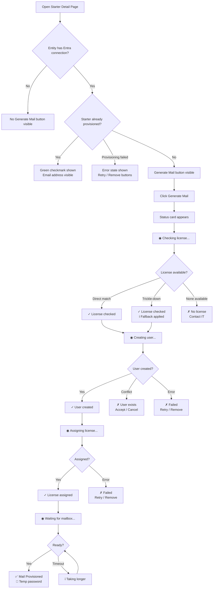
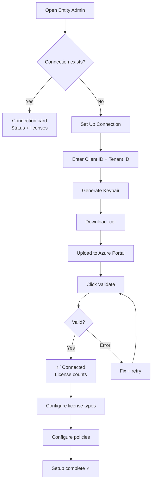
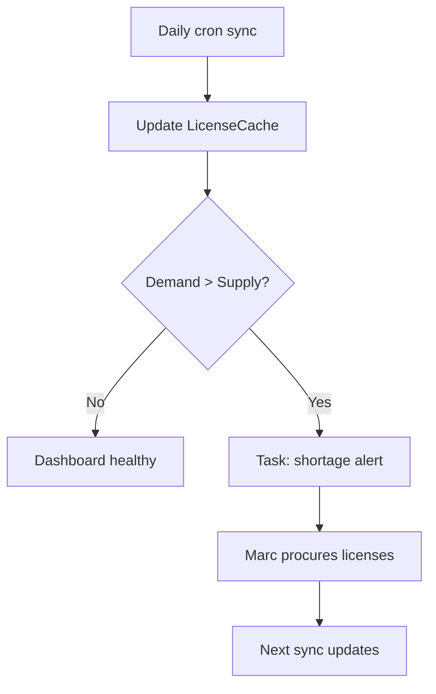

# UX Design Specification Starterskalender - Entra ID Mail Provisioning

**Author:** Kevin
**Date:** 2026-06-04

---

<!-- UX design content will be appended sequentially through collaborative workflow steps -->

## Executive Summary

### Project Vision

The Entra ID Mail Provisioning feature adds M365 mailbox provisioning to the existing starter lifecycle in Starterskalender. The UX vision is effortless automation: one button press replaces an entire IT workflow (user creation, license assignment, mailbox provisioning), while keeping the user informed at every step through real-time status updates.

The feature serves three fundamentally different interaction patterns on the same underlying system: immediate action (HR Editor clicks a button and watches it complete), configuration management (System Admin sets up connections and policies across entities), and reactive monitoring (IT Specialist responds to automated alerts and tasks). Each must feel purposeful and complete within the existing Airport UI language.

### Target Users

**Primary: Sarah — HR Entity Editor**
- Frequency: Multiple times per week during onboarding periods
- Device: Desktop only
- Tech level: Medium — comfortable with Starterskalender, unfamiliar with Azure/M365
- Goal: Provision a starter's mailbox without leaving Starterskalender or involving IT
- Pain point: Today requires filing an IT ticket and waiting for manual M365 setup
- Success metric: "I clicked one button and it was done. Tom has email on Day 1."

**Secondary: Kevin — System Administrator**
- Frequency: Incidental — when onboarding new entities or rotating certificates
- Device: Desktop, needs Azure Portal alongside
- Tech level: High — manages Starterskalender platform and Azure AD
- Goal: Connect entities to Entra ID, configure license policies, monitor health
- Pain point: Complex setup that requires context-switching between Starterskalender and Azure Portal
- Success metric: "Acme Corp is connected and configured. Functions have their license types. I can see it's healthy."

**Tertiary: Marc — IT Specialist**
- Frequency: Weekly — reacting to license alerts and cleanup tasks
- Device: Desktop
- Tech level: High — manages M365 licenses and user accounts
- Goal: Maintain sufficient licenses and clean up orphaned accounts
- Pain point: No proactive visibility into license demand; cleanup is manual and forgettable
- Success metric: "I see the shortage coming 2 weeks ahead. The cleanup task told me exactly what to remove."

### Key Design Challenges

1. **Async provisioning with real-time feedback** — Provisioning takes 10-60+ seconds across multiple Graph API calls. The UI must communicate progress through 5 backend states while showing only 3 visual states (spinner, checkmark, error). Timeout messaging must prevent user anxiety without suggesting failure.

2. **Cross-system certificate setup** — The admin must generate a keypair in Starterskalender, download a .cer file, switch to Azure Portal to upload it, then return to validate. This multi-system flow has a high risk of confusion, abandoned setups, or misconfigured connections.

3. **Cascading conditional visibility** — Generate Mail button depends on app connection. License config depends on app connection. Trickle-down config depends on license config. Password config depends on tenant settings. Users must never encounter unexplained missing UI elements.

4. **Error classification in human terms** — Graph API errors (auth failure, rate limit, timeout, conflict) must be translated to actionable user language. "Certificate authentication failed" should become "The connection to Acme Corp's Entra ID is no longer valid. Contact your administrator."

5. **Platform native integration** — Nine new components must feel indistinguishable from existing Airport admin pages. Same dialog patterns, form layouts, toast notifications, entity badges, and feedback patterns.

### Design Opportunities

1. **The "magic button" experience** — Sarah's Generate Mail flow can be the most satisfying interaction in Starterskalender: one click → smooth status progression → green checkmark → credentials displayed. The emotional arc from click to completion should feel like watching a well-choreographed process, not waiting for a loading bar.

2. **Guided configuration without a wizard** — Kevin's setup flow can use progressive disclosure and inline validation to create a wizard-like experience within the existing admin page structure. Each step reveals the next when the previous succeeds.

3. **Proactive intelligence surface** — License availability counts, demand projections, and certificate health indicators can transform the entity admin page into a dashboard that answers questions before they're asked: "Do I have enough licenses for next month's starters?"

4. **Graceful degradation communication** — Trickle-down license fallback can be communicated as a positive event ("Tom got Business Basic instead of Standard — everything set up, upgrade available later") rather than a failure, turning a limitation into a feature.

## Core User Experience

### Defining Experience

The Entra ID Mail Provisioning feature has two defining experiences, each for a different user:

**For Sarah (daily use):** The "Generate Mail" button. One click on a starter record triggers visible, progressive automation. The user watches the system work: checking licenses, creating a user, assigning a license, waiting for mailbox. Each step animates into the next. Success is a green checkmark and temporary credentials. This should feel like pressing "play" on a well-rehearsed process.

**For Kevin (setup):** The guided connection setup. A multi-step configuration flow within the existing entity admin page that reveals each step after the previous succeeds. Generate keypair → download certificate → instructions for Azure Portal → paste validation data → click validate → green confirmation. This should feel like following a recipe: clear steps, no ambiguity about what comes next.

Both experiences share a principle: the system does the complex work, the user sees the simple result.

### Platform Strategy

| Context | Platform | Input | Priority |
|---------|----------|-------|----------|
| HR provisioning (Sarah) | Web (desktop) | Mouse + keyboard | Primary |
| Admin setup (Kevin) | Web (desktop) + Azure Portal (separate tab) | Mouse + keyboard | Primary |
| IT monitoring (Marc) | Web (desktop) | Mouse + keyboard | Secondary |

No mobile support needed — all users are desktop-based admin users. No offline capability needed — all operations require live Graph API connectivity.

Leverage existing platform capabilities:
- SSE event bus for live provisioning status updates
- Toast notifications for completion/error feedback
- Existing entity admin pages as extension points
- Existing task system for IT alerts

### Effortless Interactions

**Zero-thought actions (must feel automatic):**

| Action | Target Effort | Mechanism |
|--------|--------------|-----------|
| Provision a starter's mailbox | 1 click + watch | Generate Mail button → SSE status stream |
| Check provisioning result | 0 clicks | Green checkmark replaces button after success |
| Download certificate for Azure | 1 click | .cer file download in browser |
| Validate Entra connection | 1 click | "Validate" button → real-time Graph API check |
| See license availability | 0 clicks | Dashboard shows current counts on entity admin page |
| Configure license per function | 1 field | Dropdown on existing functions admin page |

**Automated behaviors (no user action required):**
- Daily consent validation sweep (admin notified only on failure)
- Daily license cache sync (counts always fresh)
- Certificate expiry warning 30 days before (task created for admin)
- License shortage alert when demand exceeds supply (task for IT)
- Trickle-down license fallback (automatic, user informed)
- Provisioning state persistence (DB-backed, survives page refresh)

### Critical Success Moments

1. **First successful provisioning** — Sarah clicks "Generate Mail" for the first time. Status progresses smoothly. Green checkmark appears. Credentials are shown. She thinks: "That's it? No IT ticket? No waiting?" This is the moment the feature proves its value.

2. **First connection validation** — Kevin fills in the app details, clicks "Validate." The system connects to Graph API successfully. Green confirmation appears with available license counts. He thinks: "It works. I can see the licenses." This unlocks all downstream functionality.

3. **First trickle-down notification** — Sarah provisions a starter and the requested Business Standard isn't available, but Business Basic is. Instead of an error, she sees: "Business Basic assigned (Standard unavailable). Upgrade later." She thinks: "Smart. It handled it."

4. **First proactive license alert** — Marc receives a task: "3 Business Standard licenses remaining for Acme Corp. 7 starters expected next month." Before any provisioning fails, he acts. He thinks: "I saw it coming."

5. **First failed provisioning with recovery** — Provisioning fails at license assignment (Graph API timeout). Sarah sees a clear error with "Retry" button. She retries. It succeeds. She thinks: "Hiccup, but it recovered."

### Experience Principles

1. **Invisible automation** — The system does 12 Graph API calls, manages state, handles retries, encrypts credentials, writes audit logs. The user sees: button → progress → done. Complexity is never exposed.

2. **Progressive confidence** — Each configuration step builds trust. Generate keypair: "Keypair ready." Upload certificate: "Certificate uploaded." Validate connection: "Connected, 50 licenses available." Each confirmation reinforces that the next step will work too.

3. **Honest real-time feedback** — Never show a static spinner. Always tell the user what's happening now: "Checking licenses..." → "Creating user..." → "Assigning license..." → "Waiting for mailbox..." Users tolerate waiting when they see progress. They panic when they see nothing.

4. **Graceful degradation over hard failure** — When possible, the system adapts (trickle-down license) rather than fails. When failure is unavoidable, the error is actionable: what happened, what the user can do, and a clear path to recovery (retry/remove).

5. **Platform native, zero learning curve** — Every component follows existing Airport patterns: same form layouts, same toast notifications, same entity badges, same admin page structure. A user familiar with the starters module should feel immediately at home with provisioning.

## Desired Emotional Response

### Primary Emotional Goals

| User | Primary Emotion | Secondary Emotion | Design Expression |
|------|----------------|-------------------|-------------------|
| Sarah (HR Editor) | Relief ("no more IT tickets") | Confidence ("it just works") | One-click button, smooth progress animation, green checkmark completion |
| Kevin (Admin) | Control ("I see what's connected") | Trust ("the system tells me when something's wrong") | Progressive validation, health indicators, proactive certificate warnings |
| Marc (IT) | Preparedness ("I see it coming") | Efficiency ("clear task, clear action") | License dashboard, demand projection, actionable task descriptions |

### Emotional Journey Mapping

**Sarah's provisioning journey:**
1. Opens starter record → **Calm confidence** (Generate Mail button is there, ready)
2. Clicks Generate Mail → **Mild anticipation** (something is happening, status updates flowing)
3. Sees progress: "Checking licenses..." → **Engagement** (I can see it working)
4. Sees progress: "Creating user..." → **Building trust** (this is really doing the work)
5. Sees success → **Relief and satisfaction** (done, no IT ticket needed)
6. Sees credentials → **Empowerment** (I have everything I need for this starter)
7. Returns later, sees checkmark → **Reassurance** (it's still done, nothing broke)

**Sarah's failure recovery journey:**
1. Sees error: "License assignment failed" → **Concern** (not panic — error is clear)
2. Reads actionable message → **Understanding** (I know what happened)
3. Clicks "Retry" → **Hope** (let me try again)
4. Sees success after retry → **Relief** (recovered, all good)

**Kevin's setup journey:**
1. Opens entity admin, sees no connection → **Purpose** (I need to set this up)
2. Generates keypair → **Small accomplishment** (step 1 done)
3. Downloads .cer → **Progress** (moving forward)
4. Reads Azure Portal instructions → **Clarity** (I know exactly what to do next)
5. Returns from Azure, clicks Validate → **Anticipation** (moment of truth)
6. Sees green: "Connected, 50 licenses available" → **Pride** (I configured this)
7. Configures license types per function → **Completeness** (everything is ready)

### Micro-Emotions

**Critical micro-emotion pairs:**

| Desired | To Avoid | Trigger Point | Design Response |
|---------|----------|---------------|-----------------|
| Confidence | Confusion | Generate Mail button visibility | Button only appears when connection exists; tooltip explains when absent |
| Trust | Anxiety | Provisioning in progress | Step-by-step status text, never a silent spinner |
| Control | Helplessness | Provisioning failure | Clear error + "Retry" and "Remove" action buttons |
| Clarity | Overwhelm | Certificate setup flow | One section visible at a time, progressive disclosure |
| Reassurance | Doubt | After successful provisioning | Persistent green checkmark on starter record |
| Preparedness | Surprise | License running low | Proactive alert 2 weeks before shortage |

### Design Implications

**Emotion → Design decisions:**

1. **"Relief" → Immediate visual confirmation.** When provisioning succeeds, the transition from spinner to green checkmark must be unmistakable. Not a subtle icon swap — a clear visual state change with the temporary credentials prominently displayed.

2. **"Confidence" → Progressive disclosure in setup.** Kevin's setup flow reveals sections sequentially. After generating a keypair, the "Download Certificate" section appears. After downloading, the "Azure Portal Instructions" section appears. Never show all steps at once — it looks overwhelming.

3. **"Trust" → Honest status communication.** Every provisioning state has a human-readable message. Never show "Processing..." — always "Checking license availability..." or "Assigning Business Basic license..." Specificity builds trust.

4. **"Control" → Visible recovery options.** On failure, always show what went wrong and what the user can do. "Retry" resumes from the failed step (not restart). "Remove" cleans up the partial user. The user is never stuck.

5. **"Preparedness" → Dashboard-first monitoring.** License counts and certificate health are visible on the entity admin page without navigating to a separate monitoring view. Marc sees the numbers every time he visits the entity page.

6. **"Calm" → Minimize visual noise.** No red alerts unless something actually failed. Certificate expiring in 30 days = amber warning. License running low = informational banner. Connection healthy = green dot. Reserve red for actual errors.

### Emotional Design Principles

1. **Calm productivity over urgency** — This is an admin tool used within a daily workflow. No exclamation marks, no red banners for informational states. The emotional baseline is calm competence: everything works, the system informs when action is needed.

2. **Specificity builds trust** — "Assigning Business Basic license to tom.devries@acme.com" builds more trust than "Processing step 3 of 5." Users trust systems that tell them exactly what's happening, not systems that hide behind progress bars.

3. **Recovery over perfection** — Graph API calls can fail. The emotional design goal is not "provisioning never fails" (impossible) but "when it fails, recovery feels safe." Clear error → clear action → clear result.

4. **Ambient awareness over active monitoring** — License counts, certificate health, and connection status should be visible as ambient information on pages the admin already visits. No separate "monitoring dashboard" that requires a habit to check.

5. **Celebration through simplicity** — The "magic moment" is not confetti or animations — it's the contrast between the old process (IT ticket, 3 days, manual work) and the new one (1 click, 30 seconds, automatic). The celebration is the absence of effort.

## UX Pattern Analysis & Inspiration

### Inspiring Products Analysis

#### Existing Airport (Starterskalender) — Primary Reference

**Patterns to reuse directly:**

| Airport Pattern | Component | Entra Application |
|-----------------|-----------|-------------------|
| Entity admin pages | Tabbed settings per entity | Entra connection config as new section/tab on entity admin |
| Function admin pages | Per-function settings with conditional fields | License type dropdown, conditional on app connection |
| Starter detail page | Action buttons in header area | Generate Mail button placement |
| Toast notification system | Radix Toast, top-right | Provisioning success/error feedback |
| Cron job pattern | `/api/cron/*` with CRON_SECRET | Consent sweep and license sync |
| Task system | Task cards with assignment | License shortage and cleanup alerts |
| Audit log | Timestamped action log | Provisioning audit entries |

**Patterns to extend:**

| Airport Pattern | Extension for Entra |
|-----------------|---------------------|
| Static form fields | Add progressive disclosure (reveal next section on success) |
| Page-level alerts | Add ambient health indicators (connection status dot, license counts) |
| Button states | Add async-aware button (spinner → checkmark transition) |

#### Vercel / Netlify Deployment UIs — Async Status Feedback

**What they do well:**
- Real-time build log with step-by-step progression
- Clear visual states: building (spinner), deploying (progress), ready (green), failed (red)
- Each step shows timestamp and duration
- Failed step is highlighted with error message and "Redeploy" button

**Transferable for provisioning:**
- Step-by-step status display with current step highlighted
- Clear terminal state (success green / failure red)
- One-click retry from failure point
- Specific error messages per step, not generic failures

#### Stripe Connect — Multi-System Setup Flow

**What it does well:**
- Guided onboarding that spans Stripe dashboard and external verification
- Checklist-style progress (completed steps show green check, next step highlighted)
- "Continue where you left off" after returning from external system
- Clear copy-paste instructions when switching between systems
- Validation of each step before revealing the next

**Transferable for certificate setup:**
- Checklist-style connection setup (generate → download → upload to Azure → validate)
- Instructions panel for the "go to Azure Portal" step
- Copy-paste helpers for Client ID and Tenant ID
- Persistent state — if Kevin leaves and comes back, progress is preserved

#### Microsoft 365 Admin Center — License Management

**What it does well:**
- License availability shown as simple count (Available: 45 / Total: 50)
- Color-coded capacity: green (>20%), amber (5-20%), red (<5%)
- Assignment history visible per user

**Transferable for license dashboard:**
- Simple availability count format
- Color-coded capacity indicators
- Per-entity license summary

### Transferable UX Patterns

**Status Progression Pattern (from Vercel/Netlify):**
- Vertical step list with status icons: ○ pending, ◉ active (spinning), ✓ complete, ✗ failed
- Current step is highlighted and shows descriptive message
- Completed steps show green checkmark
- Failed step shows red X with error message and action button
- Application: ProvisioningStatus component during Generate Mail flow

**Progressive Setup Pattern (from Stripe Connect):**
- Section-based form where each section has a "Complete" state
- Completed sections collapse to summary view with edit button
- Next section reveals when previous succeeds
- External action step shows instructions + "I've done this" button
- Application: EntraConnectionForm for certificate setup flow

**Ambient Dashboard Pattern (from M365 Admin):**
- Key metrics shown inline on existing admin pages (not a separate dashboard)
- Color-coded badges for health status (green/amber/red)
- Click-through to details only when action needed
- Application: License counts and connection health on entity admin page

### Anti-Patterns to Avoid

| Anti-Pattern | Why It Fails | Our Approach Instead |
|-------------|-------------|---------------------|
| Generic spinner with no context | Users don't know if it's working or frozen | Always show current step name + descriptive message |
| All-at-once configuration form | Overwhelms admin with 10+ fields | Progressive disclosure: reveal sections after previous step succeeds |
| Silent background failures | Admin discovers issues days later | Proactive notification: daily sweep creates tasks on failure |
| "Something went wrong" error messages | User has no idea what to do | Specific error + specific action: "License assignment failed (timeout). Retry or Remove." |
| Separate monitoring dashboard | Nobody remembers to check a separate page | Embed health indicators in pages users already visit |
| Destructive actions without recovery | User fears clicking buttons | Every provisioning action is recoverable: retry resumes, remove cleans up |
| Certificate upload via file picker | Error-prone for Azure Portal workflow | Generate and download .cer — user uploads to Azure, not the other way |

### Design Inspiration Strategy

**Adopt (use proven patterns as-is):**
- Airport's entity admin page structure for all configuration UI
- Airport's toast/notification system for provisioning feedback
- Airport's task system for IT alerts
- M365 Admin's simple license count format

**Adapt (modify for our context):**
- Vercel's deployment status → provisioning step display (simpler, 5 steps max)
- Stripe Connect's guided setup → certificate configuration (fewer steps, no account creation)
- M365 Admin's license dashboard → inline license cards on entity admin page

**Innovate (new patterns we create):**
- "Secret-once" credential display: temporary password shown once after provisioning, then hidden forever. Copy button with confirmation.
- Trickle-down notification: informational banner within success state ("Business Basic assigned instead of Standard") — positive framing, not a warning.
- Certificate lifecycle timeline: visual indicator showing certificate age and expiry on connection card.

**Avoid:**
- Multi-step wizards (use progressive disclosure within single page instead)
- Separate monitoring pages (embed in existing admin pages)
- Generic error messages (always include specific error + action)
- Full-page loading states (use inline skeleton/spinner per section)

## Design System Foundation

### Design System Choice

**Inherited: Radix UI + shadcn/ui + Tailwind CSS 3**

Brownfield extension — the design system is predetermined by the existing Airport platform. No alternative considered; consistency with the existing calendar, tasks, and admin modules is a hard requirement.

### Rationale for Selection

| Factor | Assessment |
|--------|-----------|
| Speed | Maximum — all UI primitives already built and proven |
| Consistency | Guaranteed — same components as existing admin pages |
| Accessibility | Strong — Radix UI provides ARIA-compliant primitives |
| Team expertise | High — existing codebase demonstrates proficiency |
| Maintenance | Zero overhead — shared upgrade path with platform |
| Dark mode | Built-in — HSL CSS variables + next-themes already configured |

### Implementation Approach

**Reuse existing primitives (no modifications needed):**
- Button, Dialog, Input, Label, Select, Switch, Checkbox, Badge, Card, Tabs, Popover, DropdownMenu, Textarea
- Toast (for provisioning feedback)
- Alert (for connection health warnings)

**New Entra-specific semantic tokens:**

```css
/* Connection health */
--entra-connection-healthy: /* green 500 / green 400 dark */
--entra-connection-warning: /* amber 500 / amber 400 dark */
--entra-connection-error: /* red 500 / red 400 dark */
--entra-connection-unconfigured: /* gray 400 / gray 500 dark */

/* Provisioning states */
--entra-provisioning-active: /* blue 500 / blue 400 dark */
--entra-provisioning-success: /* green 500 / green 400 dark */
--entra-provisioning-failed: /* red 500 / red 400 dark */

/* License capacity */
--entra-license-healthy: /* green 500 / green 400 dark */
--entra-license-warning: /* amber 500 / amber 400 dark */
--entra-license-critical: /* red 500 / red 400 dark */
```

### Customization Strategy

**Component conventions (matching existing Airport patterns):**
- File location: `components/entra/ComponentName.tsx`
- Styling: Tailwind classes + `cn()` utility for conditional merging
- Variants: `class-variance-authority` when component has multiple visual states
- i18n: `useTranslations('entra.{feature}')` namespace
- Props: TypeScript strict interfaces

**New components to build (following shadcn/ui conventions):**

| Component | Category | Base Primitive |
|-----------|----------|----------------|
| GenerateMailButton | Action | Button (extended with async states) |
| ProvisioningStatus | Display | Custom (step list with SSE subscription) |
| EntraConnectionForm | Form | Card + Input + Button (progressive disclosure) |
| EntraConnectionStatus | Display | Badge (health indicator dot) |
| LicenseConfigPanel | Form | Select + Card (conditional on app connection) |
| LicenseDashboard | Display | Card (license count + capacity bar) |
| CertificateDownload | Action | Button (file download trigger) |
| TrickleDownConfig | Form | Switch + Select (policy settings) |
| PasswordConfig | Form | Input + Switch (password rules) |

All components inherit dark mode support via HSL variables. No custom media queries — Tailwind responsive prefixes only.

## Defining Experience

### The Core Interaction

**In one sentence:** "One click provisions a complete Microsoft 365 mailbox for a starter — with live status updates showing every step."

**How Sarah would describe it:** "I open the starter, click 'Generate Mail', and I can see it checking licenses, creating the user, and setting up the mailbox. Thirty seconds later it's done. Tom has email."

### User Mental Model

**Sarah's mental model:**
- Provisioning = "pressing a button and waiting for a result"
- Expects the button to work or clearly tell her why it didn't
- Doesn't think about Graph API, MSAL, or certificates
- After success, expects to see the result (checkmark, email address) without extra action

**Kevin's mental model:**
- Connection setup = "linking two systems together"
- Expects a guided process: "do this, then this, then validate"
- Understands Azure Portal — the challenge is context-switching between two admin UIs
- Expects health status at a glance: "is this connection working?"

**Current workarounds eliminated:**
- Sarah: IT helpdesk ticket → manual M365 setup → 1-3 days → credentials via email
- Kevin: M365 license management entirely in Azure Portal, no Starterskalender visibility

### Success Criteria

**Provisioning interaction:**

| Criterion | Target |
|-----------|--------|
| Button response | < 1 second to first status update |
| User informed | 5/5 provisioning steps shown with status |
| Success unmistakable | Green checkmark + credentials displayed |
| Failure actionable | Every error has Retry or Remove |
| State persistent | DB-backed, survives page refresh |

**Setup interaction:**

| Criterion | Target |
|-----------|--------|
| No confusion | Progressive disclosure, one step at a time |
| Azure Portal step clear | Copy-paste helpers for Client ID and Tenant ID |
| Validation complete | One click verifies connection + shows license count |
| Health visible | Green/amber/red dot on entity admin page |

### Novel UX Patterns

**Secret-once credential display:**
Temporary password shown exactly once after successful provisioning. Prominent "Copy" button. Warning: "This password will only be shown once." After navigation, never shown again.

**Provisioning step progression (Vercel-inspired):**
Vertical step list, each step transitions: ○ Pending → ◉ Active (spinner + message) → ✓ Completed → ✗ Failed (error + action). Mental model: "system working through steps" rather than "something loading."

**Trickle-down positive framing:**
When fallback license assigned: informational banner within success state. "Business Basic assigned (Standard unavailable). Upgrade available later." Positive framing, not a warning.

### Experience Mechanics

#### Mechanic 1: Generate Mail Flow

**1. Initiation:** Sarah opens starter detail page. "Generate Mail" button visible in action area (only when entity has active Entra connection).

**2. Interaction:**
```
┌────────────────────────────────────────────────┐
│  📧 Mail Provisioning                           │
│                                                  │
│  ✓ Checking license availability...              │
│  ◉ Creating user account...                      │
│    tom.devries@acme.com                          │
│  ○ Assigning Business Standard license           │
│  ○ Waiting for mailbox provisioning              │
└────────────────────────────────────────────────┘
```

**3. Completion (Success):**
```
┌────────────────────────────────────────────────┐
│  ✅ Mail Provisioned                             │
│                                                  │
│  ✓ License: Business Standard                    │
│  ✓ Email: tom.devries@acme.com                   │
│  ✓ Mailbox: Ready                                │
│                                                  │
│  ┌──────────────────────────────────────────┐   │
│  │  🔑 Temporary Password                    │   │
│  │  xK9#mP2$vL7n                             │   │
│  │  ⚠ Only shown once. Copy now.             │   │
│  │           [📋 Copy Password]               │   │
│  └──────────────────────────────────────────┘   │
└────────────────────────────────────────────────┘
```

**4. Completion (Failure):**
```
┌────────────────────────────────────────────────┐
│  ❌ Provisioning Failed                          │
│                                                  │
│  ✓ License available                             │
│  ✓ User created: tom.devries@acme.com            │
│  ✗ License assignment failed                     │
│    "Service temporarily unavailable."            │
│                                                  │
│  [🔄 Retry]  [🗑 Remove Created User]           │
└────────────────────────────────────────────────┘
```

#### Mechanic 2: Certificate Setup Flow (Progressive Disclosure)

**Step 1 — Connection Details:**
```
┌──────────────────────────────────────────────┐
│  🔗 Entra ID Connection                      │
│                                                │
│  Client ID:    [_________________________]    │
│  Tenant ID:    [_________________________]    │
│                                                │
│  [Generate Certificate Keypair]                │
└──────────────────────────────────────────────┘
```

**Step 2 — Certificate Upload (revealed after keypair generation):**
```
┌──────────────────────────────────────────────┐
│  ✓ Keypair generated                          │
│  [📥 Download Certificate (.cer)]             │
│                                                │
│  Next: Upload this certificate in Azure Portal │
│  1. Go to App registrations                   │
│  2. Select your app → Certificates & secrets  │
│  3. Upload the .cer file                      │
│                                                │
│  [✓ I've uploaded the certificate]            │
└──────────────────────────────────────────────┘
```

**Step 3 — Validation (revealed after confirmation):**
```
┌──────────────────────────────────────────────┐
│  ✅ Connection valid                           │
│  Available licenses:                           │
│  • Business Basic: 45 / 50                    │
│  • Business Standard: 12 / 20                 │
│  Certificate expires: 2028-06-04 (2 years)    │
└──────────────────────────────────────────────┘
```

## Visual Design Foundation

### Color System

**Inherited from Airport:** Complete HSL CSS variable system with light/dark mode support, semantic colors, entity-specific `colorHex` values.

**Entra-specific semantic colors:**

| Token | Purpose | Light | Dark | Usage |
|-------|---------|-------|------|-------|
| `--entra-connection-healthy` | Active connection | Green 500 | Green 400 | Status dot |
| `--entra-connection-warning` | Certificate expiring | Amber 500 | Amber 400 | Warning indicator |
| `--entra-connection-error` | Connection failed | Red 500 | Red 400 | Error indicator |
| `--entra-connection-unconfigured` | No connection | Gray 400 | Gray 500 | Placeholder |
| `--entra-provisioning-active` | In progress | Blue 500 | Blue 400 | Active step spinner |
| `--entra-provisioning-success` | Completed | Green 500 | Green 400 | Checkmark |
| `--entra-provisioning-failed` | Failed | Red 500 | Red 400 | Error state |
| `--entra-license-healthy` | >20% available | Green 500 | Green 400 | Capacity bar |
| `--entra-license-warning` | 5-20% available | Amber 500 | Amber 400 | Capacity bar |
| `--entra-license-critical` | <5% available | Red 500 | Red 400 | Capacity bar |

**Color rules:** Green = success/healthy. Blue = active/in-progress. Amber = warning/attention needed. Red = failure/critical only. Gray = unconfigured/empty.

### Typography System

**Inherited from Airport:** System font stack, Tailwind default scale.

**Entra-specific typography:**

| Context | Size | Weight |
|---------|------|--------|
| Section header | `text-base` | `font-semibold` |
| Status step label | `text-sm` | `font-medium` |
| Status step detail | `text-xs` | `font-normal` |
| Credential display | `text-base` | `font-mono` |
| Warning text | `text-xs` | `font-medium` |
| License count | `text-lg` | `font-bold` |
| License label | `text-sm` | `font-normal` |

### Spacing & Layout Foundation

**Inherited:** Tailwind 4px base unit, 8px primary rhythm.

| Layout | Spacing |
|--------|---------|
| Provisioning status card | `p-4` card, `gap-2` between steps |
| Connection setup form | `p-6` card, `gap-4` between sections |
| License dashboard | `gap-4` between license cards |
| Generate Mail button | Follows existing action area spacing |

### Accessibility Considerations

**Inherited:** WCAG 2.1 AA, Radix ARIA primitives, focus indicators, dark mode contrast.

**Entra-specific:**
- Status uses icons (○/◉/✓/✗) alongside colors — color never sole indicator
- Connection health dot has text label ("Connected", "Warning")
- License capacity shown as text alongside color bar
- Secret-once warning uses text + icon, not just color
- Copy button shows "Copied" text confirmation
- Retry/Remove buttons use clear text labels, not icon-only

## Design Direction Decision

### Design Directions Explored

A single design direction was explored, driven by the brownfield constraint: **Airport-native Entra ID administration**. The visual language, component library, and interaction patterns are fully inherited from the existing platform. Design exploration focused on information layout within existing admin page structures, provisioning status display density, and certificate setup flow organization.

### Chosen Direction

**Airport-native with admin-tool density.**

Key visual decisions:
- Provisioning status: vertical step list within Card (not modal or separate page)
- Connection setup: progressive disclosure sections within entity admin page (not wizard)
- License dashboard: inline card row on entity admin (not separate dashboard)
- Generate Mail button: integrated into starter detail action area
- Credential display: highlighted card within provisioning success state (secret-once)
- Connection health: small colored dot + text badge in entity admin header

### Design Rationale

| Decision | Rationale |
|----------|-----------|
| No alternative visual directions | Brownfield — different visual language breaks platform consistency |
| Inline provisioning status | Keeps user in starter context; no modal distraction |
| Progressive disclosure for setup | Reduces overwhelm; one step at a time |
| Ambient license dashboard | Visible on pages admin already visits |
| Prominent credential display | Secret-once pattern needs emphasis to ensure password is copied |

## User Journey Flows

### Journey 1: Sarah — Mail Provisioning

**Entry:** Sarah opens starter detail page
**Goal:** Provision mailbox for a new starter



### Journey 2: Kevin — Connection Setup

**Entry:** Kevin opens entity admin page → Entra ID section
**Goal:** Connect entity to Entra ID



### Journey 3: Marc — License Monitoring

**Entry:** Daily cron or entity admin visit
**Goal:** Ensure sufficient licenses



### Journey Patterns

**Progressive Status Communication:** Every async operation: initiate → step-by-step status → terminal state. Never a silent spinner.

**Conditional UI Visibility:** UI appears only when prerequisites met. Generate Mail: only with active connection. License config: only with connection. Retry/Remove: only on failure.

**Recoverable Actions:** Every failure offers retry (resume from failure) or remove (clean up). User never stuck.

### Flow Optimization Principles

1. **Front-load validation** — Check license before creating user. Fail fast.
2. **Preserve context** — Status stays on starter page. No navigation.
3. **Resume, don't restart** — Retry from failed step, not beginning.
4. **Inform, don't alarm** — Trickle-down and timeout are informational, not errors.

## Component Strategy

### Design System Components (Reuse)

**Existing primitives:** Button, Card, Dialog, Input, Label, Select, Switch, Badge, Popover, Alert, Toast, Tabs

### Custom Components

#### GenerateMailButton

**Purpose:** Primary provisioning trigger on starter detail page.
**States:** Ready (blue button), In progress (disabled, spinner), Success (hidden, replaced by ProvisioningStatus), Unavailable (not rendered)
**Props:** `starterId`, `entityId`, `disabled`

#### ProvisioningStatus

**Purpose:** Real-time provisioning progress with SSE subscription.
**Anatomy:** Card → vertical step list → credential card (success) or error actions (failure)
**States:** In progress (○/◉/✓ steps), Success (all ✓, green, credentials), Failed (✗ with Retry/Remove), Trickle-down (success + amber banner)
**Props:** `starterId`
**Dependencies:** `useProvisioningStatus` hook
**Accessibility:** Steps announce status, buttons keyboard-accessible

#### EntraConnectionForm

**Purpose:** Progressive disclosure form for connection setup.
**Anatomy:** 3 collapsible sections: Connection Details → Certificate → Validation
**States:** Empty (section 1 open), Keypair generated (section 2), Uploaded (section 3), Validated (all collapsed, green badge), Edit (any section expandable)
**Props:** `entityId`, `existingConnection?`

#### EntraConnectionStatus

**Purpose:** Compact health indicator dot + text.
**States:** Healthy (green), Warning (amber), Error (red), Unconfigured (gray)
**Props:** `entityId`

#### LicenseConfigPanel

**Purpose:** License type dropdown per job function.
**Conditional:** Only visible when entity has active connection.
**Props:** `jobRoleId`, `entityId`

#### LicenseDashboard

**Purpose:** License availability cards per entity.
**Anatomy:** Card per license type: name + "Available / Total" + capacity bar
**States:** Healthy (>20% green), Warning (5-20% amber), Critical (<5% red)
**Props:** `entityId`

#### CertificateDownload

**Purpose:** .cer file download button.
**Props:** `entityId`

#### TrickleDownConfig

**Purpose:** Tenant trickle-down policy toggle.
**Props:** `tenantId`, `enabled`

#### PasswordConfig

**Purpose:** Temporary password complexity rules.
**Anatomy:** Min length input + switches (uppercase, numbers, special chars)
**Props:** `tenantId`, `config`

### Component Implementation Strategy

| Phase | Components | Enables |
|-------|-----------|---------|
| 1a: Foundation | EntraConnectionForm, EntraConnectionStatus, CertificateDownload | Setup flow |
| 1b: Configuration | LicenseConfigPanel, TrickleDownConfig, PasswordConfig, LicenseDashboard | Policy management |
| 1c: Provisioning | GenerateMailButton, ProvisioningStatus, useProvisioningStatus | Provisioning flow |

All Phase 1 — no phased rollout (feature is all-or-nothing).

## UX Consistency Patterns

### Button Hierarchy

**Primary (1 per view):** Blue filled — "Generate Mail", "Validate Connection", "Retry"
**Secondary:** Outlined gray — "Download Certificate", "Remove User", "Edit"
**Destructive:** Red outlined, behind confirmation — "Delete Connection"
**Placement:** Primary right, secondary left (Airport convention)

### Feedback Patterns

**Toast notifications (auto-dismiss 4s):**

| Action | Toast | Style |
|--------|-------|-------|
| Provisioning success | "Mail provisioned for Tom ✓" | Green |
| Provisioning failed | "Provisioning failed. See details." | Red |
| Connection validated | "Connection validated ✓" | Green |
| Certificate generated | "Keypair generated" | Blue |
| Password copied | "Copied to clipboard ✓" | Green |

**Inline status (persistent):** Provisioning step list, connection dot, license capacity bar.

### Form Patterns

- Single-column layout (Airport convention)
- Validate on blur
- Progressive disclosure (EntraConnectionForm sections)
- Conditional fields (license config only with active connection)

### Empty States

| View | Message | Action |
|------|---------|--------|
| No connection | "No Entra ID connection configured" | "Set up connection" |
| No license config | "Configure after connecting Entra ID" | None |
| Not provisioned | Generate Mail button visible | Click |
| License cache empty | "Will sync automatically" | None |

### Loading States

- Provisioning: step list with spinner (never full-page)
- Validation: spinner on button, button disabled
- License dashboard: skeleton cards
- Never full-page spinner

## Responsive Design & Accessibility

### Responsive Strategy

**Desktop-only.** All Entra features are for internal desktop users (1280px+ viewport). No mobile or tablet optimization needed.

### Accessibility Strategy

**WCAG 2.1 Level AA** — matching existing Airport compliance.

| Requirement | Implementation |
|-------------|---------------|
| Provisioning steps | `role="listitem"`, `aria-label="[step], [status]"` |
| Active step | `aria-live="polite"` announces current step |
| Terminal state | `role="alert"` for success/failure |
| Copy password | `aria-label="Copy temporary password"`, assertive live region for "Copied" |
| Status dot | Text label always alongside dot — not icon-only |
| License capacity | Numeric value alongside color bar |
| Progressive sections | `aria-expanded` attribute |
| Action buttons | Text labels, keyboard-accessible, focus ring |

### Implementation Guidelines

- Semantic HTML: `<section>`, `<ol>` for steps, `<label>` for inputs
- ARIA only when semantic HTML insufficient
- Focus management: after provisioning, focus to result
- `prefers-reduced-motion`: disable animations
- axe-core in component tests + keyboard-only testing
