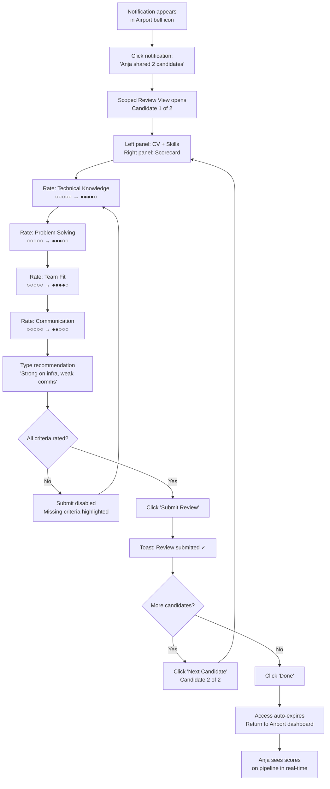
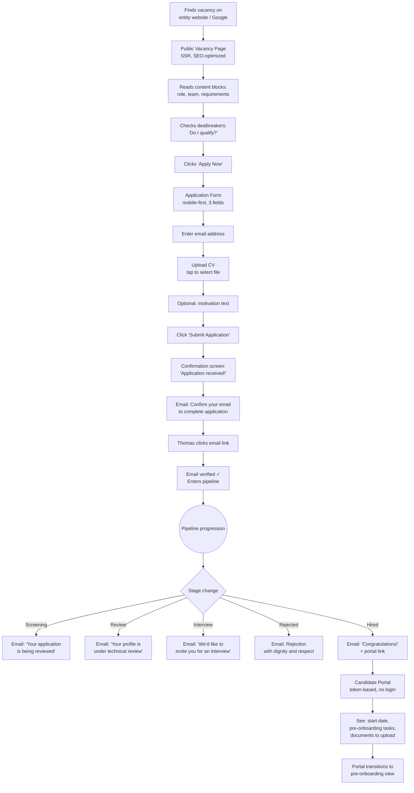
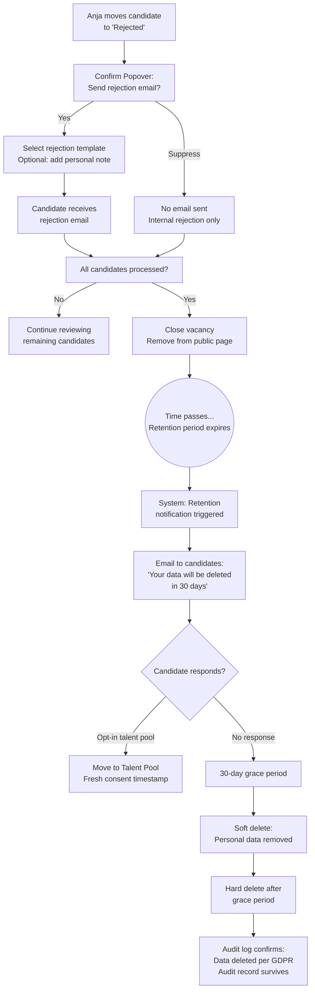

# UX Design Specification Starterskalender - Recruitment Module

**Author:** Kevin
**Date:** 2026-05-13

---

<!-- UX design content will be appended sequentially through collaborative workflow steps -->

## Executive Summary

### Project Vision

The Recruitment Module extends Airport's employee lifecycle platform upstream into the hiring pipeline, replacing the external Recruitee SaaS. The UX vision is a seamless continuum from job posting through candidate evaluation to employee onboarding — one platform, one data flow, zero handoffs.

The module serves fundamentally different user archetypes (daily power user, incidental reviewer, external candidate, executive viewer) on the same underlying data, mediated by field-level access control. The primary UX challenge is making this data-access complexity invisible to each user while keeping the headhunter's daily workflow faster than the tool it replaces.

### Target Users

**Primary: Anja — HR Headhunter**
- Frequency: Daily, multiple hours
- Device: Desktop (primary), occasionally tablet
- Tech level: High — power user of current platform
- Goal: Complete recruitment cycle faster with better collaboration
- Pain points: Context-switching between tools, all-or-nothing data sharing, manual data re-entry
- Success metric: "I can do everything from one screen and share exactly what's needed"

**Secondary: Mark — Technical Reviewer**
- Frequency: 2-3 times per quarter, minutes per session
- Device: Desktop or tablet
- Tech level: Medium — not an HR tool user
- Goal: Quick evaluation without distraction or irrelevant data
- Pain points: Too much information, unclear what's expected, time away from real work
- Success metric: "I reviewed two candidates in 3 minutes and I'm done"

**Tertiary: Thomas — External Candidate**
- Frequency: One-time application, periodic status checks
- Device: Mobile (primary), desktop
- Tech level: Variable — assume low friction tolerance
- Goal: Apply quickly, know what's happening with application
- Pain points: Account creation requirements, status uncertainty, complex forms
- Success metric: "I applied in 30 seconds and always knew where I stood"

**Quaternary: Peter — Management**
- Frequency: Monthly, brief check-ins
- Device: Desktop
- Tech level: Medium — dashboard consumer
- Goal: Pipeline visibility without asking the headhunter
- Pain points: Lack of real-time visibility, manual status reporting
- Success metric: "I got my answer in 30 seconds without bothering anyone"

### Key Design Challenges

1. **Pipeline Kanban complexity** — The daily hub must combine drag & drop, real-time multi-user updates (SSE), candidate scoring indicators, and stage-specific actions while maintaining sub-100ms interaction feedback. Must feel lightweight despite underlying RBAC and event complexity.

2. **Field-level share UX** — The core differentiator (per-field candidate data sharing) risks becoming the biggest usability hurdle. The share dialog must support common cases with one click (pre-defined templates) while allowing field-level granularity for edge cases. No user should need to understand the underlying access model.

3. **Multi-audience interface coherence** — Three distinct view levels (headhunter full access, reviewer scoped access, candidate public portal) built on the same data. Each must feel purposeful and complete, not like a restricted version of another view.

4. **Platform consistency** — The recruitment module must seamlessly integrate with the existing Airport UI language: Radix/shadcn dialogs, entity color badges, SSE-subscribed components, tabbed forms (StarterDialog pattern), filter bars with entity selector, export dropdowns. New patterns (Kanban, content block builder) must feel native.

5. **Dual responsive strategy** — Mobile-first for public vacancy pages and application form (candidate on phone), desktop-primary for Kanban pipeline and admin interfaces (headhunter at workstation). Two design approaches within one cohesive module.

### Design Opportunities

1. **"One-click share" templates** — Pre-defined share profiles (e.g., "Technical Review" = CV + skills + scorecard access) reduce the field-level share dialog to a single click for 80% of cases. Power users can customize per field. This transforms the biggest UX challenge into the signature feature.

2. **Pipeline as visual narrative** — Enrich Kanban cards with contextual indicators: dealbreaker pass/fail badges, aggregate score rings, days-in-stage counters, reviewer status icons. The board becomes a real-time story that tells Anja where action is needed without clicking into any candidate.

3. **Reviewer fast-path** — Design Mark's flow as a self-contained micro-experience: notification → scoped candidate card → scorecard → submit → done. Target: under 2 minutes, zero navigation decisions. This becomes a reusable "ad-hoc contributor" pattern for the platform.

4. **Celebratory hire transition** — The "Hired" pipeline stage triggers Starter creation. Design this as a visible moment of completion: confirmation overlay showing the candidate's journey from application to hire, with the Starter record already created. This reinforces the platform's unique value proposition.

## Core User Experience

### Defining Experience

The recruitment module is a pipeline-centric tool. The Kanban board is the primary interface — the single screen where the headhunter spends 80% of her time. Every design decision radiates outward from this center: candidate details open from the board, sharing initiates from the board, evaluations return to the board, hiring completes on the board.

The secondary defining experience is scoped collaboration: the ability to share exactly the right amount of candidate data with exactly the right person, with exactly the right duration. This is the feature that justifies the module's existence over Recruitee.

### Platform Strategy

| Context | Platform | Input | Priority |
|---------|----------|-------|----------|
| Headhunter daily workflow | Web (desktop) | Mouse + keyboard | Primary |
| Reviewer evaluation | Web (desktop/tablet) | Mouse/touch + keyboard | Secondary |
| Candidate application | Web (mobile) | Touch + on-screen keyboard | Primary (mobile-first) |
| Candidate status portal | Web (mobile) | Touch (read-only) | Secondary |
| Management dashboard | Web (desktop) | Mouse (read-only) | Tertiary |
| Public vacancy pages | Web (mobile + desktop) | Touch/mouse (read-only) | Primary (mobile-first) |

No native app required. No offline capability needed. All interactions require network connectivity for real-time data integrity.

Leverage existing platform capabilities:
- SSE event bus for live pipeline updates
- Browser notifications for share requests and evaluation completions
- Keyboard shortcuts for power-user pipeline management (arrow keys, Enter, Escape)

### Effortless Interactions

**Zero-thought actions (must feel automatic):**

| Action | Target Effort | Mechanism |
|--------|--------------|-----------|
| Move candidate to next stage | Drag + confirm | dnd-kit with confirmation dialog |
| Share with reviewer | 1 click (template) or 3 clicks (custom) | Pre-defined share profiles |
| Apply to vacancy | Upload CV + confirm email | No account, no multi-step form |
| Complete evaluation | Fill scores + submit | Single-page scorecard, no navigation |
| Check pipeline status | Open page | Board loads in <1s with all context visible |
| Hire candidate → create starter | Drag to "Hired" + confirm details | Auto-populated starter creation dialog |

**Automated behaviors (no user action required):**
- Status emails triggered on pipeline stage transitions
- Dealbreaker auto-filtering on application intake
- Score aggregation across multiple reviewers
- Access auto-expiration after evaluation submission
- Audit logging of all candidate data access
- Real-time board sync via SSE when colleagues make changes

### Critical Success Moments

1. **First drag & drop** — Anja moves a candidate on the Kanban board. It responds instantly (<100ms), the card animates smoothly, the confirmation dialog offers the right stage-specific options (send email? trigger review?). She thinks: "This is faster than Recruitee."

2. **First scoped share** — Anja clicks "Share" on a candidate, selects "Technical Review" template, picks Mark. Mark receives a notification with a clean, scoped view showing only CV and skills. Anja thinks: "I could never do this before."

3. **First sub-2-minute evaluation** — Mark opens notification, sees a focused candidate card (no noise), fills 5 scorecard criteria, types one line of recommendation, submits. Back to his real work. He thinks: "That was it? Good."

4. **First mobile application** — Thomas finds the vacancy on his phone, taps "Apply," uploads CV from phone storage, confirms email. 30 seconds total. He thinks: "That was easy."

5. **First hire-to-starter flow** — Anja drags a candidate to "Hired." A confirmation overlay shows: candidate name, entity, function, start date — all pre-filled. She confirms. The starter appears in the calendar. She thinks: "It's already there. Zero re-entry."

6. **First management check** — Peter opens the dashboard, sees pipeline metrics across entities, spots one vacancy flagged for SLA. 30 seconds, no questions needed. He thinks: "I don't need to ask Anja anymore."

### Experience Principles

1. **Pipeline-first** — The Kanban board is home. Every feature serves the pipeline or is reachable from it. If the headhunter needs to leave the board to accomplish a core task, the design has failed.

2. **Right data, right person, right time** — No user ever sees more than they need. The headhunter sees everything. The reviewer sees exactly what was shared. The candidate sees only their own status. Access is additive (default: nothing visible) and temporary (default: expires after use).

3. **One click for common, three clicks for custom** — Every frequent action has a fast path. Share with template = 1 click. Share with custom fields = 3 clicks. Move candidate = drag + 1 confirm. Hire = drag + 1 confirm. The power is there for edge cases, but the happy path is instant.

4. **Invisible complexity** — RBAC, field masking, audit logging, SSE sync, GDPR retention — all happen silently. The user never encounters an access model, a permission dialog, or a sync indicator during normal flow. The system is doing enormous work; the user sees effortless simplicity.

5. **Platform native** — Every new component feels like it belongs in Airport. Same dialog patterns, same entity badges, same filter bars, same color language. A user familiar with the calendar or tasks module should feel immediately at home in recruitment.

## Desired Emotional Response

### Primary Emotional Goals

| User | Primary Emotion | Secondary Emotion | Design Expression |
|------|----------------|-------------------|-------------------|
| Headhunter (Anja) | In control | Relief ("finally, proper sharing") | Pipeline-centric single screen, field-level share with visual confirmation |
| Reviewer (Mark) | Respected (time-efficient) | Clarity (zero ambiguity) | Minimal scoped view, prominent scorecard, clear "done" state |
| Candidate (Thomas) | Professionalism (trust) | Certainty ("I know where I stand") | Clean public pages, instant confirmation, transparent status updates |
| Management (Peter) | Informed (self-service) | Confidence in process | Dashboard with answers before questions, no drill-down needed |

### Emotional Journey Mapping

**Headhunter emotional arc:**
1. Opens pipeline → **Calm confidence** (everything visible, nothing requires hunting)
2. Reviews candidates → **Focused efficiency** (cards tell the story, scores visible)
3. Shares with reviewer → **Empowerment** (controls exactly what's visible)
4. Receives evaluation → **Satisfaction** (results appear inline, no context switch)
5. Hires candidate → **Pride and closure** (visual celebration, automatic starter creation)
6. GDPR compliance → **Peace of mind** (automated, no manual tracking)

**Reviewer emotional arc:**
1. Receives notification → **Mild curiosity** (not intrusive, clear what's needed)
2. Opens scoped view → **Appreciation** (clean, focused, no noise)
3. Fills scorecard → **Engaged concentration** (clear criteria, intuitive inputs)
4. Submits evaluation → **Relief and satisfaction** (done, back to real work)

**Candidate emotional arc:**
1. Finds vacancy → **Interest** (professional presentation, clear requirements)
2. Applies → **Ease** (30 seconds, no barriers)
3. Receives confirmation → **Reassurance** (immediate, professional)
4. Gets status updates → **Engaged anticipation** (transparent process)
5. Gets rejected → **Disappointment but respect** (personal, dignified)
6. Gets hired → **Excitement** (portal shows what's next, continuity)

### Micro-Emotions

**Critical micro-emotion pairs:**

| Desired | To Avoid | Trigger Point | Design Response |
|---------|----------|---------------|-----------------|
| Confidence | Confusion | Sharing candidate data | Visual preview of exactly which fields the reviewer will see |
| Trust | Skepticism | Reviewer viewing scoped data | Clear "shared by [name] on [date]" attribution, no sense of hidden data |
| Accomplishment | Frustration | Completing pipeline actions | Instant visual feedback, smooth animations, clear state changes |
| Calm | Anxiety | Managing GDPR compliance | Automated retention indicators, no manual deadline tracking |
| Efficiency | Overwhelm | Opening pipeline with many candidates | Smart defaults (entity filter, stage filter), progressive disclosure |
| Delight | Indifference | Hiring a candidate | Celebratory transition moment, automatic starter creation |

### Design Implications

**Emotion → Design decisions:**

1. **"In control" → Information density done right.** The Kanban board shows maximum relevant information without clutter. Each card carries: name, score indicator, days-in-stage, reviewer status. No card requires clicking to understand its state.

2. **"Respected time" → Minimal chrome for reviewers.** The scoped reviewer view strips away all navigation, sidebars, and module switching. It's a focused card + scorecard. Nothing else competes for attention.

3. **"Professional trust" → Public page quality.** Vacancy pages must feel premium — clean typography, structured content, entity branding, no generic template feel. This is the organization's first impression on candidates.

4. **"Forgiveness" → Undo and confirmation.** Every destructive or significant action (stage move, share, reject) has a confirmation step. Stage moves offer undo within a grace period. Share links can be revoked instantly.

5. **"Certainty" → Visual state communication.** Every candidate card visually communicates its state without text: pipeline stage (column position), score (ring/badge), review status (icon), days waiting (counter). The board is readable at a glance.

### Emotional Design Principles

1. **Calm productivity over excitement** — This is a daily work tool, not an engagement platform. The emotional target is quiet efficiency: everything works, nothing surprises, the user finishes faster than expected.

2. **Respect through restraint** — Show less, not more. Scoped views are not "restricted views" — they are purposefully designed experiences that respect the viewer's role and time.

3. **Confidence through transparency** — Every share action shows a preview. Every pipeline move shows what will happen (email sent? review triggered?). The user always knows the consequence before committing.

4. **Dignity in every outcome** — Rejection emails, expired access notices, and deletion notifications are written with the same care as welcome messages. The candidate experience reflects the organization's values.

5. **Celebration at milestones** — The hire moment deserves a visual moment. Not confetti — a clean confirmation that acknowledges the journey from vacancy to hire. Subtle but meaningful.

## UX Pattern Analysis & Inspiration

### Inspiring Products Analysis

#### Recruitee — Primary UX Benchmark

**What it does well (match or exceed):**

| Pattern | What Works | Design Implication |
|---------|-----------|-------------------|
| Pipeline Kanban | Clean board, intuitive drag & drop, clear stage columns | Our Kanban must feel equally natural. dnd-kit provides the technical foundation; visual polish must match. |
| Candidate cards | Compact, scannable, key info visible without opening | Cards must carry: name, applied date, score indicator, stage, source — same density level. |
| Vacancy creation | Straightforward form flow, templates available | Our template-based builder must be at least as fast. Content blocks add power without adding friction. |
| Stage transitions | Smooth drag, immediate visual feedback | Sub-100ms feedback non-negotiable. Optimistic updates with rollback. |
| Email automation | Status emails sent automatically on stage changes | Match with our configurable email templates per stage. |
| Overall navigation | Clear hierarchy: vacancies → pipeline → candidate | Maintain same mental model: vacancy list → pipeline board → candidate detail. |

**Where it falls short (our opportunity):**

| Gap | Impact on Anja | Our Solution |
|-----|---------------|-------------|
| All-or-nothing sharing | Must share entire profile for technical review — exposes personal data | Field-level sharing with pre-defined templates. The core USP. |
| No onboarding bridge | Hired candidate data must be manually re-entered in Airport | Automatic Starter creation on hire. Zero re-entry. |
| Cost vs usage | Full-featured SaaS pricing for partial feature usage | Purpose-built module with exactly what's needed. |
| Entity isolation | Limited multi-org support | Native multi-entity with entity-scoped RBAC, matching Airport's existing model. |
| Audit trail depth | Basic activity log | Immutable field-level access audit for GDPR/DPO compliance. |

**Key principle: Anja should feel at home on day one.** The recruitment module's navigation, card layouts, and pipeline interaction must feel familiar to a Recruitee user. The learning curve should be near-zero for core actions.

#### Existing Airport Platform — Consistency Guide

**Patterns to reuse directly:**

| Airport Pattern | Component | Recruitment Application |
|-----------------|-----------|------------------------|
| Entity color badges | CalendarView, StarterCard | Vacancy cards, pipeline headers — entity identity at a glance |
| Tabbed complex dialog | StarterDialog | Candidate detail dialog (profile, documents, evaluations, comments, history) |
| Filter bar + entity selector | CalendarView, StartersTable | Pipeline view: entity filter, stage filter, search |
| SSE real-time updates | SSEProvider + useSSE hook | Pipeline board subscribes to `recruitment:*` events |
| Status icons | TaskStatusIcon (Lucide) | Candidate status (applied, reviewing, interviewed, offered, hired, rejected) |
| Export functionality | ExportDropdown (CSV/PDF/XLSX) | Candidate list export, pipeline report |
| Notification bell | NotificationBell | Share requests, evaluation completions |
| Data table with search | StartersTable | Vacancy list view, candidate search across vacancies |

**Patterns to extend:**

| Airport Pattern | Extension for Recruitment |
|-----------------|-------------------------|
| StarterDialog tabs | Add: Documents tab (SharePoint), Evaluations tab (scorecards), Shares tab (access log) |
| Entity membership RBAC | Add: recruitment-specific permissions (headhunter, reviewer, share-viewer) |
| EmailTemplate system | Add: recruitment email types (application confirmation, stage transition, rejection, retention notice) |
| AuditLog | Add: field-level access logging (who saw which fields, via what mechanism) |

**New patterns needed (not in Airport today):**

| New Pattern | Purpose | Design Approach |
|-------------|---------|-----------------|
| Kanban board | Pipeline visualization | dnd-kit columns, inspired by Recruitee's clean board aesthetic |
| Content block builder | Vacancy creation | Modular blocks (text, requirements, benefits, media) — inspired by Notion's block model but simpler |
| Share dialog with field picker | Scoped data sharing | Template selector + optional field-level override — no equivalent in any standard tool |
| Scorecard form | Candidate evaluation | Inline rating + text per criterion — inspired by Greenhouse's structured scorecards |
| Public vacancy page | External-facing SEO pages | Clean, branded, mobile-first — separate design language from internal admin |

#### Supplementary Inspiration Sources

**Trello / Linear (Kanban patterns):**
- Trello: Card simplicity, label system, drag smoothness
- Linear: Keyboard shortcuts for power users, clean minimal aesthetic, status indicators
- **Adopt:** Keyboard navigation (arrow keys between stages), visual card density from Linear's approach

**Notion (Content block patterns):**
- Block-based content creation, drag to reorder
- **Adapt:** Simplified for vacancy content — fewer block types (text, list, media, requirements), no nested blocks. Vacancy builder should feel like composing content, not configuring a system.

**Greenhouse (Recruitment UX patterns):**
- Structured scorecards with criteria ratings
- Interview scheduling integration
- **Adopt:** Scorecard UI with clear criteria, star/numeric rating, text field per criterion. Side-by-side candidate comparison layout (Phase 2).

### Transferable UX Patterns

**Navigation Pattern: Vacancy → Pipeline → Candidate**
- Source: Recruitee
- Application: Three-level drill-down. Vacancy list (table/cards) → Pipeline board (Kanban) → Candidate detail (tabbed dialog). Back navigation always returns to board context.
- Design: Breadcrumb or persistent header showing current vacancy while viewing candidate.

**Interaction Pattern: Drag & Confirm**
- Source: Recruitee + Trello
- Application: Drag candidate card to new stage → confirmation dialog appears with stage-specific options (send email? request review? add note?). Not just a move — a contextual action trigger.
- Design: Small confirmation popover anchored to drop target, not a full-screen dialog.

**Interaction Pattern: Quick Actions on Card**
- Source: Linear (hover actions)
- Application: Candidate card shows hover actions: Share, Comment, Move (dropdown), View Profile. Eliminates need to open detail dialog for common actions.
- Design: Subtle action icons that appear on hover, hidden by default for clean appearance.

**Visual Pattern: Entity-Coded Pipeline**
- Source: Existing Airport entity badges
- Application: Pipeline board header shows entity color + name. Candidate cards carry entity badge when viewing cross-entity. Filter bar pre-selects user's primary entity.
- Design: Consistent with Airport's existing color language.

**Form Pattern: Progressive Disclosure**
- Source: Notion (content creation)
- Application: Vacancy builder starts with essentials (title, entity, template). Advanced options (dealbreakers, stage config, custom fields) revealed on demand. Prevents overwhelm on creation.
- Design: "Basic" section always visible, "Advanced" collapsible sections below.

### Anti-Patterns to Avoid

| Anti-Pattern | Why It Fails | Our Approach Instead |
|-------------|-------------|---------------------|
| Permission dialogs interrupting flow | Users click away without reading, creates anxiety | Invisible RBAC — enforce server-side, never show "you don't have permission" if the UI shouldn't show the action at all |
| Overloaded candidate cards | Too many fields on Kanban card reduces scannability | Maximum 4-5 data points per card: name, score, days-in-stage, status icon, entity badge |
| Multi-step wizards for simple actions | Every extra step increases abandonment | One-step dialogs with smart defaults. Vacancy creation: pick template → edit content. Not a 5-step wizard. |
| Separate "settings" context for pipeline config | Breaks flow — user leaves pipeline to configure it | Stage configuration inline on the pipeline view (gear icon → slide-out panel) |
| Generic "are you sure?" confirmations | Teaches users to click "yes" without thinking | Context-specific confirmations: "Move Thomas to Interview? This will email him the interview invitation." |
| Forcing mobile layout on desktop | Desktop users have more screen real estate — use it | Desktop-optimized Kanban with generous column widths. Mobile gets a simplified list view of pipeline, not a squeezed board. |

### Design Inspiration Strategy

**Adopt (use as-is):**
- Recruitee's navigation mental model (vacancy → pipeline → candidate)
- Airport's entity badges, filter bars, dialog patterns, notification bell
- Keyboard shortcuts for pipeline navigation (Linear-inspired)

**Adapt (modify for our context):**
- Recruitee's Kanban cards → add score indicators, reviewer status, days counter
- Notion's block model → simplified for vacancy content (5 block types max)
- Greenhouse's scorecards → inline on scoped reviewer view, not a separate page
- Trello's drag & drop → add contextual confirmation with stage-specific actions

**Innovate (new patterns we create):**
- Share dialog with template + field picker — no existing product does this well
- Scoped reviewer micro-experience — self-contained evaluation flow with no navigation
- Hire-to-starter transition — visual bridge between recruitment and onboarding modules
- Visual field masking preview — "this is exactly what Mark will see" confirmation in share dialog

**Avoid:**
- Permission-based UI blocking (hide instead of disable)
- Multi-step wizards for common actions
- Generic confirmation dialogs without context
- Forced mobile-responsive Kanban (use dedicated mobile layout instead)

## Design System Foundation

### Design System Choice

**Inherited: Radix UI + shadcn/ui + Tailwind CSS 3**

This is a brownfield extension — the design system is predetermined by the existing Airport platform. No alternative was considered; introducing a different system would fragment the codebase and break the "platform native" experience principle.

### Rationale for Selection

| Factor | Assessment |
|--------|-----------|
| Speed | Maximum — 15 UI primitives already built, patterns established |
| Consistency | Guaranteed — same components as calendar, tasks, admin |
| Uniqueness | Not needed — internal tool, brand consistency > differentiation |
| Accessibility | Strong — Radix UI provides ARIA-compliant primitives |
| Team expertise | High — existing codebase demonstrates proficiency |
| Maintenance | Zero overhead — no additional dependency, shared upgrade path |
| Dark mode | Built-in — HSL CSS variables + next-themes already configured |

### Implementation Approach

**Reuse existing primitives (no modifications needed):**
- Button, Dialog, Select, Input, Label, Textarea, Checkbox, Switch
- Badge (for entity colors, status indicators)
- Card (for candidate cards, vacancy cards)
- Tabs (for candidate detail dialog)
- DropdownMenu (for quick actions, export)
- Popover (for confirmation popovers on drag & drop)

**Extend existing primitives:**
- ExportDropdown → add recruitment-specific export formats
- Badge → add recruitment-specific variants (score, stage, dealbreaker)

**New components to build (following shadcn/ui conventions):**

| Component | Category | Pattern Reference |
|-----------|----------|-------------------|
| KanbanBoard | Layout | New — dnd-kit based, no existing equivalent |
| KanbanColumn | Layout | New — stage column with header + card list |
| CandidateCard | Display | Follows StarterCard density pattern |
| ContentBlockEditor | Form | New — simplified Notion-style block system |
| ContentBlock | Display | New — renders typed content blocks |
| FieldPicker | Form | New — checkbox grid for field-level selection |
| ShareTemplateSelector | Form | New — template cards with field preview |
| ScorecardInput | Form | New — rating + text per criterion |
| ScoreRing | Display | New — compact circular score indicator |
| DaysCounter | Display | New — days-in-stage badge |
| StageIndicator | Display | Extends Badge — pipeline stage with color |
| ConfirmPopover | Overlay | Extends Popover — contextual confirm with message |

### Customization Strategy

**Design tokens (extend existing HSL variable system):**

```css
/* Recruitment-specific semantic tokens */
--recruitment-stage-new: /* blue */
--recruitment-stage-review: /* amber */
--recruitment-stage-interview: /* purple */
--recruitment-stage-offer: /* green */
--recruitment-stage-hired: /* emerald */
--recruitment-stage-rejected: /* red */
--recruitment-score-high: /* green */
--recruitment-score-medium: /* amber */
--recruitment-score-low: /* red */
--recruitment-dealbreaker-pass: /* green */
--recruitment-dealbreaker-fail: /* red */
```

**Public page design register:**
Public vacancy pages use the same Tailwind CSS foundation but with entity-specific branding:
- Entity logo and color from Airport config
- Clean, marketing-oriented typography scale
- No shadcn/ui chrome — public pages feel like a website, not an admin tool
- Responsive grid optimized for mobile-first reading

**Component convention:**
All new recruitment components follow existing patterns:
- File location: `components/recruitment/{feature}/ComponentName.tsx`
- Styling: Tailwind classes + `cn()` utility for conditional merging
- Variants: `class-variance-authority` when component has multiple visual states
- Props: TypeScript strict interfaces, Zod for runtime validation where needed
- i18n: `useTranslations('recruitment.{feature}')` namespace

## Defining Experience

### The Core Interaction

**In one sentence:** "Share exactly the right candidate data with exactly the right person, with exactly the right duration — in one click."

**Why this, not the pipeline?** The Kanban pipeline is table stakes — Recruitee already does this well, and Anja likes it. The pipeline must be excellent (matching Recruitee), but it's not what makes Airport Recruitment special. What makes it special is the thing Anja couldn't do before: controlled, scoped, temporary data sharing with visual confirmation of what the reviewer will see.

**How Anja would describe it:** "I click Share, pick 'Technical Review,' choose Mark, and done. Mark sees only the CV and skills. No name, no age, no address. After his evaluation, his access disappears. I didn't have to think about privacy — the system handled it."

### User Mental Model

**Anja's mental model (headhunter):**
- She thinks in terms of **people** (candidates) and **stages** (where they are in the process)
- Sharing is like **handing someone a folder** — she picks which papers go in it
- She expects to **control** what others see, like choosing which pages to photocopy
- Pipeline stages are **physical columns** — moving someone means picking them up and placing them

**Mark's mental model (reviewer):**
- He receives a **focused task** — "review these candidates"
- He expects a **complete package** — everything he needs, nothing he doesn't
- He doesn't think about permissions or access — he just sees what was shared
- Evaluation is like **filling out a form** — criteria, scores, recommendation, submit

**Thomas's mental model (candidate):**
- Job application is like **dropping off a letter** — submit, wait for response
- Status updates are like **tracking a package** — where is my application now?
- The portal is like a **waiting room noticeboard** — check status, see next steps

**Current workarounds (what we eliminate):**
- Anja currently exports a PDF from Recruitee, manually redacts personal info, emails it to Mark → replaced by one-click scoped share
- Mark currently receives candidates via email/Teams with full data exposure → replaced by field-masked view with scorecard
- Hired candidates are manually re-entered in Airport → replaced by automatic Starter creation

### Success Criteria

**The share interaction succeeds when:**

| Criterion | Measurement | Target |
|-----------|------------|--------|
| Anja can share without thinking about privacy | Template covers 80%+ of share cases | 1 click for common shares |
| Mark receives exactly what he needs | No fields visible beyond what was shared | Zero data leakage |
| The system is faster than email + PDF | Total time from "I want to share" to "Mark has access" | < 10 seconds |
| Audit trail is complete | Every share, view, and evaluation logged | 100% coverage |
| Access expires automatically | Reviewer access revoked after evaluation or timeout | Zero manual cleanup |

**The pipeline interaction succeeds when:**

| Criterion | Measurement | Target |
|-----------|------------|--------|
| Board loads with full context | All candidates, scores, stages visible | < 1 second |
| Drag & drop feels instant | Visual response to grab, drag, drop | < 100ms |
| Stage move triggers correct workflow | Email, notification, or review request fires | Zero manual follow-up |
| Real-time sync works | Colleague's changes appear without refresh | < 2 seconds via SSE |
| Anja feels at home from day one | Navigation matches Recruitee mental model | Near-zero learning curve |

### Novel UX Patterns

**Novel: Field-level share with visual preview**
No standard product offers this exact interaction. It combines:
- Template selection (Greenhouse-style profile types)
- Field-level override (permission matrix UI)
- Visual preview ("this is exactly what Mark will see")
- Temporal control (auto-expire after evaluation)

This requires user education on first use. Design approach:
- First-time tooltip: "Choose a share template or customize which fields to include"
- Visual preview panel shows the receiver's view in real-time as fields change
- Default templates cover 80% of cases — custom field selection is progressive disclosure

**Novel: Contextual stage-move confirmation**
Unlike Trello/Recruitee where drag & drop just moves a card, our pipeline moves trigger workflows. The confirmation popover is context-aware:
- Move to "Review" → "Send review request to [name]? [Email template preview]"
- Move to "Interview" → "Send interview invitation to [candidate]?"
- Move to "Rejected" → "Send rejection email? [Select template]"
- Move to "Hired" → "Create Starter record? [Pre-filled details]"

This is a new pattern: drag triggers a contextual action, not just a status change.

**Established: Everything else**
Pipeline Kanban, vacancy builder, scorecard form, public pages — all use proven patterns. No user education needed for these.

### Experience Mechanics

#### Mechanic 1: Scoped Share Flow

**1. Initiation:**
- Anja views a candidate on the Kanban board
- She clicks the "Share" icon on the candidate card (or opens candidate detail → "Share" button)
- Share dialog opens as a Radix dialog overlay

**2. Interaction:**
```
┌─────────────────────────────────────────────────┐
│  Share [Candidate Name] with...                  │
│                                                   │
│  ┌─────────────────────────────────────────────┐ │
│  │ 👤 Select reviewer     [User picker ▼]      │ │
│  └─────────────────────────────────────────────┘ │
│                                                   │
│  Share profile:                                   │
│  ┌──────────┐ ┌──────────┐ ┌──────────┐        │
│  │Technical │ │    HR    │ │  Custom  │        │
│  │ Review   │ │  Review  │ │          │        │
│  │ ✓ CV     │ │ ✓ CV     │ │ Pick     │        │
│  │ ✓ Skills │ │ ✓ Skills │ │ fields...│        │
│  │ ✓ Score  │ │ ✓ Name   │ │          │        │
│  │          │ │ ✓ Contact│ │          │        │
│  │          │ │ ✓ Score  │ │          │        │
│  └──────────┘ └──────────┘ └──────────┘        │
│                                                   │
│  ⏱ Access expires: [After evaluation ▼]          │
│                                                   │
│  Preview: "Mark will see..."                      │
│  ┌─────────────────────────────────────────────┐ │
│  │  [Masked candidate card preview]             │ │
│  │  CV: ✓  Skills: ✓  Name: ✗  Address: ✗     │ │
│  └─────────────────────────────────────────────┘ │
│                                                   │
│              [Cancel]  [Share →]                   │
└─────────────────────────────────────────────────┘
```

**3. Feedback:**
- Template selection highlights active template with checkmark
- Preview panel updates in real-time as fields change
- "Custom" tab reveals full field checklist with toggles
- "Share" button shows recipient name: "Share with Mark →"

**4. Completion:**
- Toast notification: "Shared with Mark. He'll receive a notification."
- Candidate card on Kanban shows share indicator (small avatar of Mark)
- Mark receives in-app notification + optional email
- Audit log entry created automatically

#### Mechanic 2: Pipeline Stage Move

**1. Initiation:**
- Anja grabs a candidate card on the Kanban board (mouse down or keyboard Enter)
- Card lifts with subtle shadow, origin column dims slightly

**2. Interaction:**
- Drag card over target column — column highlights with stage color
- Drop card — confirmation popover appears anchored to card's new position:

```
┌──────────────────────────────────────┐
│ Move Thomas → Interview              │
│                                       │
│ ☑ Send interview invitation email    │
│   Template: [Interview invite ▼]     │
│                                       │
│ ☐ Add note                           │
│                                       │
│        [Cancel]  [Confirm →]          │
└──────────────────────────────────────┘
```

**3. Feedback:**
- Optimistic update: card appears in new column immediately
- Confirmation popover shows stage-specific options
- On confirm: toast "Thomas moved to Interview. Email sent."
- SSE broadcasts change to other users viewing same pipeline

**4. Completion:**
- Card settles in new column with updated timestamp
- If email was sent, small mail icon appears on card briefly
- Other users see the move reflected in real-time
- If cancelled: card animates back to original column (rollback)

#### Mechanic 3: Reviewer Evaluation Flow

**1. Initiation:**
- Mark receives notification: "Anja shared 2 candidates for your review"
- Click-through opens scoped candidate view directly (no navigation needed)

**2. Interaction:**
```
┌─────────────────────────────────────────────────┐
│  Candidate Review                    1 of 2 ► │
│                                                   │
│  ┌─────────────────┐  ┌──────────────────────┐  │
│  │  CV Summary      │  │  Scorecard           │  │
│  │  [rendered CV]   │  │                      │  │
│  │                  │  │  Technical knowledge  │  │
│  │  Skills          │  │  ○ ○ ○ ○ ○           │  │
│  │  • Infrastructure│  │                      │  │
│  │  • Team mgmt     │  │  Problem solving     │  │
│  │  • Dutch C1      │  │  ○ ○ ○ ○ ○           │  │
│  │                  │  │                      │  │
│  │                  │  │  Communication        │  │
│  │                  │  │  ○ ○ ○ ○ ○           │  │
│  │                  │  │                      │  │
│  │                  │  │  Recommendation       │  │
│  │                  │  │  [                  ] │  │
│  │                  │  │                      │  │
│  └─────────────────┘  │    [Submit review →]  │  │
│                        └──────────────────────┘  │
│                                                   │
│  Shared by Anja · Expires after evaluation        │
└─────────────────────────────────────────────────┘
```

**3. Feedback:**
- Score circles fill with color as rated (green for high, amber for medium)
- All criteria must be rated before submit enables
- Character count on recommendation field (optional but encouraged)

**4. Completion:**
- "Thank you. Your evaluation has been submitted."
- "Next candidate" button if multiple shared, or "Done" to close
- Access to this candidate's data expires automatically
- Anja sees Mark's scores appear on her pipeline board in real-time

## Visual Design Foundation

### Color System

**Inherited from Airport:**
The recruitment module inherits the complete Airport color system: HSL CSS variables with light/dark mode support, semantic colors (primary, secondary, destructive, muted, accent), and entity-specific `colorHex` values. No changes to the base system.

**Recruitment-specific semantic colors:**

| Token | Purpose | Light Mode | Dark Mode | Usage |
|-------|---------|-----------|-----------|-------|
| `--stage-new` | New/Applied stage | Blue 500 | Blue 400 | Stage column header, card indicator |
| `--stage-screening` | Screening stage | Cyan 500 | Cyan 400 | Stage column header |
| `--stage-review` | Technical Review | Amber 500 | Amber 400 | Stage column header |
| `--stage-interview` | Interview stage | Purple 500 | Purple 400 | Stage column header |
| `--stage-offer` | Offer stage | Emerald 500 | Emerald 400 | Stage column header |
| `--stage-hired` | Hired (terminal) | Green 600 | Green 400 | Stage column header, celebration |
| `--stage-rejected` | Rejected (terminal) | Red 500 | Red 400 | Stage column header |
| `--score-high` | Score 4-5 | Green 500 | Green 400 | ScoreRing, score badge |
| `--score-medium` | Score 3 | Amber 500 | Amber 400 | ScoreRing, score badge |
| `--score-low` | Score 1-2 | Red 500 | Red 400 | ScoreRing, score badge |
| `--dealbreaker-pass` | Meets requirement | Green 500 | Green 400 | Dealbreaker indicator |
| `--dealbreaker-fail` | Fails requirement | Red 500 | Red 400 | Dealbreaker indicator, auto-filter |

**Color usage rules:**
- Stage colors are used in column headers and as subtle left-border accents on cards — not as card backgrounds (too noisy at scale)
- Entity colors (`colorHex`) take precedence on entity badges, matching existing Airport pattern
- Score colors are used sparingly: small ring indicator on card, full color only in detail view
- Terminal stages (Hired, Rejected) use stronger visual weight than intermediate stages
- Dark mode: all recruitment colors shift to 400-level for sufficient contrast on dark backgrounds

**Public page colors:**
Public vacancy pages use entity branding (logo + primary color from Airport config) rather than the internal admin color system. The public palette is:
- Entity primary color (from `colorHex`) for accents, buttons, links
- Neutral grays for text and backgrounds
- White/near-white card backgrounds
- No dark mode on public pages (simplicity for external audience)

### Typography System

**Inherited from Airport:**
The existing font stack applies to all internal recruitment interfaces:
- Primary: System font stack (`-apple-system, BlinkMacSystemFont, "Segoe UI", ...`) or Inter if loaded
- Monospace: For code/technical content only (not applicable to recruitment)
- Type scale: Tailwind default scale (`text-xs` through `text-4xl`)

**Recruitment-specific typography guidance:**

| Context | Size | Weight | Usage |
|---------|------|--------|-------|
| Pipeline column header | `text-sm` | `font-semibold` | Stage name + candidate count |
| Candidate card name | `text-sm` | `font-medium` | Primary identifier on Kanban card |
| Candidate card metadata | `text-xs` | `font-normal` | Days-in-stage, source, entity badge |
| Score value | `text-lg` | `font-bold` | Aggregate score in detail view |
| Scorecard criterion | `text-sm` | `font-medium` | Criterion label in evaluation form |
| Share dialog section headers | `text-sm` | `font-semibold` | "Share profile:", "Preview:" |
| Vacancy page title (public) | `text-3xl` | `font-bold` | Vacancy title on public detail page |
| Vacancy page body (public) | `text-base` | `font-normal` | Content blocks on public page |
| Apply button (public) | `text-lg` | `font-semibold` | Primary CTA on vacancy page |

**Public page typography:**
Public vacancy pages use a slightly more generous typographic scale for readability on mobile:
- Heading: `text-2xl` to `text-3xl` (larger than internal admin)
- Body: `text-base` with `leading-relaxed` (1.625 line height)
- Content blocks: Clear visual hierarchy with spacing between blocks
- Dealbreaker list: Bold with icon prefix for scannability

### Spacing & Layout Foundation

**Inherited grid system:**
Tailwind's spacing scale (4px base unit) with 8px as the primary rhythm:
- Component internal padding: `p-3` (12px) to `p-4` (16px)
- Card gaps: `gap-3` (12px) for Kanban columns
- Section spacing: `space-y-6` (24px) between major sections
- Page padding: `px-6` (24px) sides, `py-4` (16px) top/bottom

**Recruitment-specific layout patterns:**

| Layout | Structure | Spacing | Rationale |
|--------|-----------|---------|-----------|
| Pipeline Kanban | Horizontal scroll, equal-width columns | `gap-3` between columns, `gap-2` between cards | Dense but scannable; horizontal scroll for 5+ stages |
| Candidate card | Fixed-width card in column | `p-3` internal padding | Compact — 4-5 data points visible without scrolling |
| Candidate detail | Full-width dialog with tabs | `p-6` content padding, `gap-4` between sections | Spacious — detail view is for reading and acting |
| Share dialog | Centered modal, 480px max width | `p-6` padding, `gap-4` between sections | Focused — no horizontal scrolling, clear hierarchy |
| Scorecard | Two-column (data + form) or stacked on mobile | `gap-6` between columns, `gap-3` between criteria | Side-by-side for desktop, stacked for mobile |
| Vacancy list | Table (desktop) or card list (mobile) | Standard table spacing (matches StartersTable) | Familiar — matches existing Airport data tables |
| Public vacancy | Single-column centered, max-width 720px | `py-8` between content blocks, `px-4` mobile | Marketing-style — generous whitespace, readable |
| Application form | Single-column, max-width 480px | `gap-4` between fields | Minimal — as few fields as possible |

**Information density spectrum:**

```
Dense ◄────────────────────────────────► Spacious
Kanban cards    Pipeline board    Detail dialog    Public pages
(compact)       (balanced)        (comfortable)    (generous)
```

The Kanban board prioritizes density — Anja needs to see many candidates at once. The detail dialog and public pages prioritize readability — users are reading and evaluating, not scanning.

### Accessibility Considerations

**Inherited from Airport:**
- Radix UI primitives provide ARIA-compliant components out of the box
- Dark mode support via HSL variables maintains contrast in both themes
- Focus indicators on all interactive elements (existing Tailwind ring)

**Recruitment-specific accessibility:**

| Requirement | Implementation | Priority |
|-------------|---------------|----------|
| Kanban keyboard navigation | dnd-kit accessibility features: arrow keys between stages, Enter to grab/drop | High |
| Score color independence | Score rings show numeric value alongside color — color never sole indicator | High |
| Stage color independence | Stage columns show stage name as text, not just color header | High |
| Dealbreaker indicators | Checkmark/X icon + text label alongside green/red color | High |
| Public page contrast | WCAG 2.1 AA minimum (4.5:1 for body text, 3:1 for large text) on all public pages | Critical |
| Form validation | Error messages announced to screen readers, linked to fields via `aria-describedby` | High |
| Scorecard labels | Each rating criterion has explicit label, rating scale announced | Medium |
| Share dialog focus trap | Focus trapped within dialog, Escape to close, Tab cycles through controls | High (Radix default) |
| Candidate card screen reader | Card reads: "[Name], [stage], [score], [days in stage]" in logical order | Medium |

## Design Direction Decision

### Design Directions Explored

A single design direction was explored, driven by the brownfield constraint: **Airport-native recruitment module**. The visual language, component library, and interaction patterns are inherited from the existing platform. Meaningful design exploration focused on layout density, component arrangement, and recruitment-specific interaction patterns rather than visual style alternatives.

An interactive HTML mockup was created at `ux-design-directions.html` showcasing 7 key screens:
1. Pipeline Kanban board with stage-colored columns, candidate cards, score rings, dealbreaker badges, reviewer avatars, and hover actions
2. Share dialog with template selection, field preview, access duration control
3. Reviewer scoped evaluation view with two-column layout (CV + scorecard)
4. Public vacancy page with entity branding, content blocks, requirements list
5. Mobile application form (iPhone frame) with minimal fields
6. Contextual stage-move confirmation popovers
7. Celebratory hire-to-starter transition dialog

### Chosen Direction

**Airport-native with recruitment density spectrum.**

The design direction follows the existing Airport visual language with a deliberate density gradient:
- **Dense:** Kanban cards (compact, 4-5 data points, scannable at a glance)
- **Balanced:** Pipeline board (comfortable column spacing, clear stage headers)
- **Comfortable:** Candidate detail dialog, share dialog (spacious padding, clear hierarchy)
- **Generous:** Public vacancy pages (marketing-style whitespace, mobile-first readable)

Key visual decisions locked in:
- Stage colors as column header accents + subtle card left-border (not card backgrounds)
- Score rings: small circular indicators with numeric value inside, color-coded
- Dealbreaker badges: green checkmark/red X with text label
- Reviewer avatars: small circles on card showing share/evaluation status
- Hover actions on cards: Share, Comment icons appear on mouse hover
- Entity badges: colored pills matching existing Airport entity color system
- Confirmation popovers anchored to drop target (not full-screen dialogs)
- Hire dialog: green gradient banner celebrating the transition moment

### Design Rationale

| Decision | Rationale |
|----------|-----------|
| No alternative visual directions explored | Brownfield project — introducing a different visual language would break the "platform native" experience principle |
| Density gradient approach | Different screens serve different purposes: scanning (Kanban), acting (dialogs), reading (public pages) |
| Stage colors in headers only | Cards at scale with colored backgrounds create visual noise; subtle left-border accent is sufficient |
| Score rings over bars/stars | Compact, works at card scale (28px), communicates value without text |
| Hover actions over persistent buttons | Keeps cards clean; power users discover quickly; touch users use detail view |
| Popover over dialog for stage moves | Lighter weight, stays in pipeline context, doesn't obscure the board |
| Green celebration banner for hire | Emotional design principle: milestone moments deserve visual acknowledgment |
| Mobile frame for apply form | Forces design thinking in mobile-first context for the candidate experience |

### Implementation Approach

All screens in the HTML mockup translate directly to implementation using the established design system:

| Mockup Screen | Implementation Components |
|---------------|--------------------------|
| Pipeline Kanban | `PipelineKanban` + `StageColumn` + `CandidateCard` (dnd-kit) |
| Share Dialog | `ShareDialog` + `ShareTemplateSelector` + `FieldPicker` (Radix Dialog) |
| Reviewer View | `CandidateScoped` + `ScorecardForm` (standalone layout) |
| Public Vacancy | `VacancyDetail` + `ContentBlock` + `ApplicationForm` (SSR page) |
| Mobile Apply | `ApplicationForm` (responsive, same component) |
| Stage Move | `CandidateMoveDialog` (Radix Popover) |
| Hire Moment | Custom hire confirmation within `CandidateMoveDialog` |

The HTML mockup serves as the visual reference for implementation. Each screen's layout, spacing, and color usage should be matched during component development.

## User Journey Flows

### Journey 1: Anja — Full Recruitment Cycle

**Entry:** Anja opens recruitment module from Airport sidebar navigation
**Goal:** Create vacancy → receive applications → evaluate → hire

```mermaid
flowchart TD
    A[Open Recruitment Module] --> B{Has vacancies?}
    B -->|Yes| C[Vacancy List View]
    B -->|No| D[Empty State: Create First Vacancy]
    D --> E
    C --> E[Click 'New Vacancy']
    
    E --> F{Use template?}
    F -->|Yes| G[Select Template]
    F -->|No| H[Blank Vacancy]
    G --> I[Vacancy Builder<br/>Pre-filled from template]
    H --> I
    
    I --> J[Edit Content Blocks<br/>Title, description, requirements]
    J --> K[Configure Dealbreakers<br/>Required: driver's license, Dutch]
    K --> L[Configure Nice-to-haves<br/>Weighted preferences]
    L --> M[Configure Pipeline Stages<br/>Default or custom]
    M --> N[Configure Email Templates<br/>Per stage]
    N --> O{Ready to publish?}
    O -->|Save draft| P[Saved as Draft]
    O -->|Publish| Q[Published to entity page]
    
    Q --> R[Pipeline Kanban View<br/>Waiting for applications]
    R --> S((Applications arrive))
    
    S --> T[System auto-filters<br/>Dealbreaker check]
    T --> U{Passes dealbreakers?}
    U -->|No| V[Card shown faded<br/>Dealbreaker fail badge]
    U -->|Yes| W[Card in 'Applied' column<br/>Score calculated]
    
    W --> X[Anja reviews candidates<br/>On Kanban board]
    X --> Y[Drag candidate to<br/>'Technical Review']
    Y --> Z[Confirm Popover:<br/>Send review request?]
    Z --> AA[Click 'Share' on card]
    
    AA --> AB[Share Dialog opens]
    AB --> AC[Select reviewer: Mark]
    AC --> AD[Select template:<br/>'Technical Review']
    AD --> AE[Preview: Mark sees<br/>CV + Skills only]
    AE --> AF[Click 'Share with Mark']
    AF --> AG[Toast: Shared ✓<br/>Mark receives notification]
    
    AG --> AH((Mark evaluates))
    AH --> AI[Score appears on<br/>candidate card in real-time]
    
    AI --> AJ[Anja reviews scores]
    AJ --> AK[Drag to 'Interview']
    AK --> AL[Confirm: Send<br/>interview invitation?]
    
    AL --> AM[Interview completed]
    AM --> AN[Drag to 'Offer']
    AN --> AO[Drag to 'Hired']
    AO --> AP[Hire Dialog:<br/>Confirm starter details]
    AP --> AQ[Starter created in Airport ✓<br/>Celebration moment]
```



**Key decision points:**
- Template selection at vacancy creation (progressive disclosure)
- Publish vs. save draft (safe default: draft)
- Share template vs. custom field selection (1 click vs. 3)
- Email send/suppress per stage transition (default: send)

**Error recovery:**
- Drag to wrong stage → Cancel in confirmation popover (card returns)
- Wrong reviewer selected → Revoke share from candidate detail
- Published too early → Unpublish from vacancy settings

---

### Journey 2: Mark — Reviewer Evaluation

**Entry:** Mark receives notification in Airport
**Goal:** Evaluate shared candidates and return to work



**Optimizations:**
- Zero navigation: notification → review view → submit → done
- "Next candidate" button eliminates return-to-list step
- All criteria visible simultaneously (no scrolling on desktop)
- Submit only enables when all criteria rated (prevents incomplete reviews)

**Total interaction time target:** < 2 minutes for 2 candidates

---

### Journey 3: Thomas — Candidate Application

**Entry:** Thomas finds vacancy on entity website (mobile)
**Goal:** Apply quickly, track status, eventually get hired



**Mobile-first optimizations:**
- Application form: 3 fields max (email, CV, optional motivation)
- File upload: native mobile file picker, accepts camera capture
- No account creation, no password
- Email verification as spam prevention (not friction — candidate expects confirmation)

**Status communication:**
- Every stage transition triggers an email (configurable per stage)
- Emails contain clear next steps, not just status
- Rejection email uses dignified template with specific vacancy context

---

### Journey 4: Anja — Rejection & GDPR Compliance

**Entry:** Vacancy closing or GDPR retention trigger
**Goal:** Properly close recruitment cycle with compliance



**Compliance safeguards:**
- Retention period configurable in admin settings
- Automated — Anja doesn't need to remember deletion dates
- Audit log survives data deletion (immutable)
- DPO can audit at any time via existing AuditLog interface

---

### Journey Patterns

**Pattern: Contextual Confirmation**
Every significant action follows: Action → Context-specific confirmation → Execute → Feedback toast. The confirmation always shows what will happen (email sent, access granted, record created), never a generic "are you sure?"

**Pattern: Progressive Disclosure**
Complex forms (vacancy builder, share dialog) show essentials first with advanced options collapsible. User never faces a wall of fields.

**Pattern: Notification-to-Action**
All share requests and evaluation completions route through Airport's notification bell. Click-through goes directly to the action context (review view, candidate detail), not a generic list.

**Pattern: Real-time Feedback Loop**
Every action by one user (share, evaluate, move, comment) reflects immediately for other users via SSE. The pipeline board is a living document — Anja never needs to refresh.

**Pattern: Graceful Terminal States**
Rejected candidates get dignity (personal email). Hired candidates get celebration (starter creation). Expired access gets a clean close (auto-revoke). Every journey endpoint is designed, not just the happy path.

### Flow Optimization Principles

1. **Minimize steps to value** — Every journey targets the fewest possible interactions. Application: 3 fields. Evaluation: 5 scores + 1 text. Share: 1 click (template).

2. **Front-load information, back-load action** — Show all context before asking for a decision. Kanban shows scores before you drag. Share dialog shows preview before you share. Evaluation shows CV before you rate.

3. **Default to the common case** — Email templates pre-selected. Share templates pre-configured. Pipeline stages have defaults. Power users can override; most users never need to.

4. **Make errors cheap** — Wrong stage? Cancel in popover. Wrong share? Revoke from detail. Wrong publish? Unpublish. No action is irreversible except hard deletion (which has a 30-day grace period).

5. **Close every loop** — Every action produces visible confirmation. Shares show avatars on cards. Evaluations show score rings. Hires show starter records. Nothing disappears into a void.

## Component Strategy

### Design System Components (Reuse)

**15 existing primitives from `components/ui/`:**
Alert, Badge, Button, Card, Checkbox, Dialog, DropdownMenu, Input, Label, Popover, Select, Switch, Tabs, Textarea, ExportDropdown

**Existing feature components to reference:**
- `StarterCard` — pattern for CandidateCard density
- `StarterDialog` — pattern for candidate detail tabbed dialog
- `CalendarView` — pattern for filter bar + entity selector + SSE subscription
- `TaskStatusIcon` — pattern for candidate status icons
- `NotificationBell` — pattern for share request notifications
- `SSEProvider` — reuse directly for pipeline real-time updates

### Custom Components

#### PipelineKanban

**Purpose:** Primary daily interface — displays all candidates for a vacancy organized by pipeline stage as a horizontal board.
**Usage:** Vacancy detail page (`/recruitment/vacatures/[id]`)
**Anatomy:** Filter bar → Stage columns (horizontal scroll) → Candidate cards within columns
**States:**

| State | Behavior |
|-------|----------|
| Loading | Skeleton columns with placeholder cards |
| Empty (no candidates) | Illustration + "Waiting for applications" message |
| Active | Populated columns, cards draggable |
| Dragging | Grabbed card lifts with shadow, source column dims, target column highlights |
| Drop target hover | Column border pulses with stage color |
| SSE update | New/moved card animates into position with subtle highlight |

**Props:** `vacancyId`, `stages`, `onCandidateMove`, `onCandidateClick`
**Accessibility:** Arrow keys navigate between columns, Enter opens candidate, Space grabs card for keyboard drag
**Dependencies:** dnd-kit (`@dnd-kit/core`, `@dnd-kit/sortable`), SSEProvider

#### CandidateCard

**Purpose:** Compact representation of a candidate within a pipeline column. Must communicate status at a glance without opening.
**Usage:** Inside PipelineKanban stage columns
**Anatomy:**

```
┌──────────────────────────┐
│ [Name]         [Entity]  │  ← top row
│ ⏱ 3d · Indeed            │  ← metadata
│──────────────────────────│
│ [DB badge] [Score] [Avs] │  ← bottom row
└──────────────────────────┘
```

**States:**

| State | Visual |
|-------|--------|
| Default | White card, border |
| Hover | Elevated shadow, action icons appear |
| Dragging | Reduced opacity at source, full card follows cursor |
| Dealbreaker fail | 50% opacity, red X badge |
| New (< 24h) | Subtle blue left-border accent |
| SLA warning (> 7d in stage) | Days counter turns amber |
| SLA exceeded (> 14d) | Days counter turns red |

**Props:** `candidate`, `onShare`, `onComment`, `onOpen`
**Accessibility:** Focusable, reads "Thomas de Vries, ACEG, score 4.2, 3 days in stage" to screen reader

#### ShareDialog

**Purpose:** The USP interaction — allows headhunter to share candidate data with scoped field visibility.
**Usage:** Triggered from CandidateCard hover action or candidate detail view
**Anatomy:** Reviewer picker → Template cards (3) → Access duration → Field preview → Actions
**States:**

| State | Behavior |
|-------|----------|
| Default | "Technical Review" template pre-selected |
| Template selected | Selected card highlighted blue, preview updates |
| Custom mode | Field checklist revealed below templates |
| Field toggled | Preview updates in real-time (visible/hidden pills) |
| Loading | Spinner on "Share" button during API call |
| Success | Dialog closes, toast confirmation |
| Error | Inline error message, button re-enabled |

**Props:** `candidateId`, `candidateName`, `onShare`, `onClose`
**Accessibility:** Focus trap, Escape to close, Tab through templates → fields → actions

#### ShareTemplateSelector

**Purpose:** Template cards for common share profiles, eliminating per-field selection for 80% of cases.
**Usage:** Inside ShareDialog
**Anatomy:** 3 cards in a row: "Technical Review" | "HR Review" | "Custom"
**States:** Unselected (border only), Selected (blue border + background), Hover (subtle highlight)
**Variants:** Configurable templates from admin settings (admin can add/edit share templates)
**Props:** `templates`, `selected`, `onSelect`

#### FieldPicker

**Purpose:** Checkbox grid for per-field candidate data selection (shown in "Custom" share mode).
**Usage:** Inside ShareDialog when "Custom" template selected
**Anatomy:** Two-column grid of field toggles with category headers (Personal, Professional, Documents)
**States:** Each field: checked (green) / unchecked (gray striped)
**Props:** `availableFields`, `selectedFields`, `onChange`
**Accessibility:** Each checkbox labeled with field name, grouped by category with `role="group"`

#### ScorecardForm

**Purpose:** Evaluation form for reviewers — criteria ratings + text recommendation.
**Usage:** Reviewer scoped view (right panel)
**Anatomy:** Criterion list (label + 5 rating dots each) → Recommendation textarea → Submit button
**States:**

| State | Behavior |
|-------|----------|
| Empty | All dots unfilled, submit disabled |
| Partially filled | Filled dots colored green, submit still disabled |
| Complete | All criteria rated, submit enabled (blue) |
| Submitting | Spinner on button, form disabled |
| Submitted | "Review submitted ✓" confirmation |

**Props:** `criteria`, `onSubmit`, `candidateId`
**Accessibility:** Each criterion group labeled, dots are radio buttons with numeric values announced

#### CandidateMoveDialog

**Purpose:** Contextual confirmation popover shown after dropping a candidate in a new stage.
**Usage:** Triggered by pipeline drag & drop completion
**Anatomy:** Stage transition header → Options (email, note) → Template selector → Confirm/Cancel
**States:** Default (normal stage), Rejection (red confirm button), Hire (green, expanded with starter fields)
**Variants:**

| Target Stage | Variant |
|-------------|---------|
| Any intermediate | Standard: email toggle + template selector |
| Rejected | Red: rejection template + optional reason |
| Hired | Green: expanded with starter detail fields (entity, function, start date) |

**Props:** `candidateId`, `fromStage`, `toStage`, `onConfirm`, `onCancel`
**Accessibility:** Focus trap within popover, Escape to cancel (card returns to source)

#### ScoreRing

**Purpose:** Compact circular indicator showing aggregate candidate score.
**Usage:** CandidateCard bottom row, candidate detail header
**Anatomy:** 28px circle with numeric score (1 decimal) centered
**States:** High (≥4.0, green), Medium (3.0–3.9, amber), Low (<3.0, red), No score (gray dashed outline)
**Props:** `score`, `size` (sm: 24px, default: 28px, lg: 36px)
**Accessibility:** `aria-label="Score: 4.2 out of 5"`

#### DaysCounter

**Purpose:** Shows how long a candidate has been in their current pipeline stage.
**Usage:** CandidateCard metadata row
**Anatomy:** Clock icon + number + "d" suffix
**States:** Normal (gray, ≤7d), Warning (amber, 8–14d), Exceeded (red, >14d)
**Props:** `days`, `warningThreshold`, `exceededThreshold`

#### ContentBlockEditor

**Purpose:** Modular content builder for vacancy descriptions (Notion-inspired, simplified).
**Usage:** Vacancy creation/edit page
**Anatomy:** Ordered list of typed blocks, each with type icon + content area + drag handle
**Block types:** Text (rich paragraph), List (bullet items), Requirements (dealbreaker/nice-to-have), Benefits (icon + text), Media (image from SharePoint library)
**States:** View mode (rendered), Edit mode (inline editing), Drag reorder (block lifts)
**Props:** `blocks`, `onChange`, `availableBlockTypes`
**Accessibility:** Each block focusable, arrow keys reorder, Enter to edit, Escape to stop editing

#### VacancyCard

**Purpose:** Public vacancy listing item on entity job page.
**Usage:** Public vacancy list page (`/jobs/[entityGroup]`)
**Anatomy:** Title + location + type + entity badge + posted date + short description
**States:** Default, Hover (elevated)
**Props:** `vacancy`

#### ApplicationForm

**Purpose:** Candidate application form — minimal fields, mobile-first.
**Usage:** Public vacancy detail page apply section
**Anatomy:** Email input → CV upload zone → Optional motivation textarea → Submit button → Privacy notice
**States:** Empty, Filling (fields validated on blur), Submitting (spinner), Success (confirmation), Error (inline)
**Props:** `vacancyId`, `onSubmit`
**Accessibility:** All fields labeled, validation errors linked via `aria-describedby`, file upload keyboard accessible

### Component Implementation Strategy

**Build order driven by user journey criticality:**

| Phase | Components | Journey Dependency |
|-------|-----------|-------------------|
| Phase 1a: Pipeline core | PipelineKanban, CandidateCard, ScoreRing, DaysCounter, CandidateMoveDialog | Journey 1 (Anja daily workflow) |
| Phase 1b: Share flow | ShareDialog, ShareTemplateSelector, FieldPicker | Journey 1 + 2 (USP feature) |
| Phase 1c: Evaluation | ScorecardForm | Journey 2 (Mark reviewer flow) |
| Phase 1d: Public presence | VacancyCard, ApplicationForm, ContentBlockEditor | Journey 3 (Thomas application) |
| Phase 2: Enhancement | CandidatePortal, DashboardWidgets | Journeys 4, 5 |

**Implementation conventions:**
- Each component in `components/recruitment/{feature}/ComponentName.tsx`
- Shared types in `lib/recruitment/types.ts`
- All strings via `useTranslations('recruitment.{namespace}')`
- All new components dark-mode compatible via HSL variables

### Implementation Roadmap

**Wave 1 MVP (August 2026):**
All Phase 1 components (a through d). These enable the complete recruitment cycle: create vacancy → receive applications → evaluate → hire.

**Wave 2 (Q4 2026):**
- CandidatePortal component (token-based status view)
- VacancyWidget (embeddable web component for external sites)
- CandidateComparison (side-by-side scorecard view)

**Wave 3 (2027):**
- RecruitmentDashboard widgets (pipeline metrics, funnel charts)
- TalentPoolView (retained candidate management)
- AssessmentIntegration component

## UX Consistency Patterns

### Button Hierarchy

**Primary action (1 per view):**
Blue filled button — the single most important action on the current screen.
- Pipeline view: "New Vacancy"
- Vacancy builder: "Publish"
- Share dialog: "Share with [Name]"
- Scorecard: "Submit Review"
- Application form: "Submit Application"

**Secondary actions:**
Outlined button (gray border) — important but not the primary flow.
- "Save Draft", "Cancel", "Export", "Filter"

**Destructive actions:**
Red outlined button, never primary prominence. Always behind a confirmation.
- "Delete Vacancy", "Revoke Access", "Remove Candidate"

**Ghost actions (icon-only or text link):**
Minimal visual weight for frequent micro-actions.
- CandidateCard hover: share icon, comment icon, open icon
- Content block: drag handle, delete block, edit block

**Placement convention:**
- Dialogs: primary right, cancel left (matches existing Airport dialogs)
- Page headers: primary action right-aligned in header bar
- Forms: primary action bottom-right, secondary bottom-left

### Feedback Patterns

**Toast notifications (non-blocking, auto-dismiss 4s):**

| Action | Toast | Icon |
|--------|-------|------|
| Share sent | "Shared with Mark ✓" | Check circle, green |
| Review submitted | "Review submitted ✓" | Check circle, green |
| Vacancy published | "Vacancy published — live on entity page" | Rocket, blue |
| Vacancy saved as draft | "Draft saved" | Save, gray |
| Candidate moved | "[Name] moved to [Stage]" | Arrow right, blue |
| Email sent | "Email sent to [Name]" | Mail, blue |
| Error (any) | "[Description]. Try again." | Alert triangle, red |
| Access revoked | "Access revoked for [Name]" | Shield, amber |

**Toast positioning:** Top-right, stacked (matches existing Airport toast system via Radix Toast).

**Inline validation (forms):**
- Validate on blur (not on keystroke)
- Error text below field in red, linked via `aria-describedby`
- Success: green check icon appears in field (no text)
- Required fields: asterisk in label, not as placeholder

**Optimistic updates:**
Pipeline drag & drop updates UI immediately. If server rejects: card animates back to source column + error toast. SSE confirms final state for other connected clients.

**Progress indicators:**
- Button actions: spinner replaces button text, button disabled
- Page loads: skeleton screens matching final layout (never a full-page spinner)
- File upload: progress bar inside upload zone
- Long operations (vacancy publish): spinner + "Publishing..." text

### Form Patterns

**Form density:** Single-column for all recruitment forms. No multi-column field layouts (reduces cognitive load, mobile-compatible by default).

**Field grouping:** Related fields grouped under section headers with subtle dividers. Vacancy builder uses visual blocks instead of field groups.

**Default values:**
- Entity selector: pre-filled with user's assigned entity
- Pipeline stages: pre-filled with default template (Screening → Review → Interview → Offer → Hired)
- Email templates: pre-selected based on target stage
- Share template: "Technical Review" pre-selected

**Autosave:** Vacancy builder autosaves every 30 seconds when in draft. Visual indicator: "Saved just now" / "Saving..." in toolbar. No manual save button needed in edit mode (publish is the deliberate action).

**Conditional fields:**
- Share dialog: field picker only appears when "Custom" template selected
- CandidateMoveDialog: starter fields only appear when target stage is "Hired"
- Vacancy builder: dealbreaker config only appears when requirements block is added

**File upload pattern:**
- Dashed border drop zone with upload icon
- Accepts drag & drop + click to browse
- CV: PDF only, max 10MB
- Shows filename + size after upload, X to remove
- Upload starts immediately on selection (no separate "Upload" button)

### Navigation Patterns

**Module entry:** Sidebar icon "Recruitment" in Airport main navigation → lands on vacancy list (most recent first).

**Page hierarchy:**

```
Recruitment (sidebar)
├── Vacancies (list) ← default landing
│   ├── [Vacancy] (pipeline kanban) ← primary workspace
│   │   ├── [Candidate] (detail dialog, overlay)
│   │   └── Settings (vacancy settings, slide-over)
│   └── New Vacancy (builder, full page)
├── Talent Pool (list)
└── Settings (admin, tabs)
```

**Navigation style:**
- List → Detail: standard page navigation (URL changes, browser back works)
- Candidate detail: dialog overlay on pipeline (pipeline stays visible behind, URL updates with candidate ID as query param)
- Settings/configuration: slide-over panel from right (Radix Sheet)

**Breadcrumb:** Shown on all pages except the vacancy list. Format: `Recruitment > [Vacancy Title] > [Optional context]`

**Return navigation:** Dialog/overlay close returns to pipeline. Page-level back uses browser history. No custom "back" buttons — users use browser/keyboard navigation or breadcrumbs.

**Deep linking:** Every view has a shareable URL. Candidate detail links work for users with access; unauthorized users see "No access" message (not a 404).

### Pipeline Interaction Patterns

**Drag & drop rules:**
- Cards can only move forward or to "Rejected" (no backward movement — prevents accidental un-screening)
- Exception: admin can move backward via candidate detail dropdown
- Multi-select drag: not supported in MVP (one card at a time)
- Touch devices: long-press to grab (with haptic feedback if available)

**Stage transitions always confirm:**
Every drag produces a contextual popover before executing. The popover content adapts to the target stage:
- Normal stage: "Move to [Stage]? Email: [template]. Send? ☑"
- Rejected: "Reject [Name]? Template: [rejection]. Send? ☑ Reason: [optional text]"
- Hired: "Hire [Name]! Entity: [select]. Function: [select]. Start date: [date]. Create starter? ☑"

**Cancel = undo:** Clicking "Cancel" or pressing Escape in any confirmation returns the card to its source position. The user never needs an explicit undo feature.

**Filtering:** Filter bar above columns with: Entity selector (multi), Source (dropdown), Score range (min-max), SLA status (on track/warning/exceeded). Filters persist in URL query params (shareable filtered views).

### Empty States

**Pattern:** Every empty state includes: illustration (subtle, not cartoonish) + headline + description + primary action button.

| View | Headline | Action |
|------|----------|--------|
| Vacancy list (no vacancies) | "No vacancies yet" | "Create your first vacancy" |
| Pipeline (no candidates) | "Waiting for candidates" | "Share vacancy link" (copies URL) |
| Talent pool (empty) | "Your talent pool is empty" | "Candidates are added here when they opt in after rejection" |
| Reviews (no pending) | "All caught up!" | (no action — this is a success state) |
| Search results (empty) | "No candidates match your filters" | "Clear filters" |

### Loading States

**Skeleton screens** match the final layout structure:
- Pipeline: gray columns with 3 card-shaped placeholders each
- Vacancy list: card-shaped rows with text placeholders
- Candidate detail: tabs with content area placeholders

**Never show:** Full-page spinners, blocking overlays, or "Loading..." text without context.

**SSE reconnection:** If SSE connection drops, a subtle amber banner appears below the filter bar: "Reconnecting..." → auto-reconnects → banner disappears. No user action needed.

### Modal & Overlay Patterns

**Dialog (Radix Dialog):** Used for focused tasks that need full attention.
- ShareDialog, CandidateMoveDialog (hire variant)
- Always closeable via Escape or backdrop click
- Focus trapped within dialog
- Backdrop: semi-transparent dark overlay

**Sheet (Radix Sheet, from right):** Used for configuration and settings.
- Vacancy settings, admin configuration
- Wider than dialog (480px), slides from right
- Content scrollable, actions pinned at bottom

**Popover (Radix Popover):** Used for contextual confirmations attached to a trigger.
- Stage move confirmation (non-hire)
- Positioned near the drop target
- No backdrop — pipeline stays fully visible

**Rule:** If the action takes < 3 fields: Popover. If 3–6 fields: Dialog. If > 6 fields or needs scrolling: Sheet.

### Search & Filtering Patterns

**Global candidate search:** Search bar in vacancy list header. Searches across all vacancies and candidates (name, email, source). Results grouped by vacancy.

**Pipeline filtering:** Filter bar integrated above kanban columns. Filters are additive (AND logic). Active filters shown as removable chips below the filter bar.

**Vacancy list filtering:** Entity filter + Status filter (Active/Draft/Closed) + Sort (Recent/Oldest/Most candidates).

**Search behavior:**
- Debounced input (300ms)
- Minimum 2 characters to trigger
- Results highlight matching text
- Empty results: "No candidates match '[query]'" with clear action

### Notification Patterns

**In-app (Airport notification bell):**
- Share request: "[Anja] shared 2 candidates for review"
- Evaluation complete: "[Mark] submitted review for [Thomas]"
- New application: "New application from [Thomas] for [Vacancy]"
- SLA warning: "[Candidate] has been in [Stage] for 14 days"
- Click-through goes directly to the action context

**Email (SendGrid):**
- Stage transition emails to candidates (configurable per stage)
- Share request emails to reviewers (with magic link)
- GDPR retention notices to candidates
- All emails use Airport branding template with entity-specific logo

**Notification grouping:** Multiple events of the same type within 5 minutes are grouped ("3 new applications for [Vacancy]" instead of 3 separate notifications).

## Responsive Design & Accessibility

### Responsive Strategy

**Desktop-first for internal users, mobile-first for external users.**

The recruitment module has a split audience:
- **Internal users** (Anja, Mark): exclusively desktop (Airport is a desktop-first enterprise app). Optimize for 1280px+ with dense information layouts.
- **External users** (Thomas, candidates): primarily mobile. Public vacancy pages and application forms must be flawless at 375px.

**Desktop (internal — pipeline, management):**
- Full kanban board with horizontal scroll for 6+ stages
- Candidate detail as dialog overlay (pipeline stays visible)
- Side-by-side layouts for reviewer view (CV left, scorecard right)
- Filter bar always visible above pipeline
- Dense information: CandidateCards show all metadata at a glance

**Tablet (internal — occasional use):**
- Pipeline columns stack 3 wide (horizontal scroll for remaining)
- Drag & drop works with touch (long-press to grab via dnd-kit touch sensor)
- Candidate detail becomes full-screen dialog (no overlay on pipeline)
- Filter bar collapses to icon button → filter sheet

**Mobile (external — candidate-facing only):**
- Public vacancy pages: single-column, full-width content blocks
- Application form: stacked fields, large touch targets
- Confirmation/status pages: centered, minimal
- No internal recruitment features on mobile (not a use case)

### Breakpoint Strategy

**Inheriting Airport's existing Tailwind breakpoints:**

| Breakpoint | Width | Target |
|-----------|-------|--------|
| `sm` | 640px | Mobile landscape |
| `md` | 768px | Tablet portrait |
| `lg` | 1024px | Tablet landscape / small desktop |
| `xl` | 1280px | Standard desktop (primary target) |
| `2xl` | 1536px | Wide desktop |

**Recruitment-specific layout changes:**

| Breakpoint | Pipeline | Candidate detail | Vacancy page (public) |
|-----------|----------|------------------|-----------------------|
| < `md` | Not available | Not available | Single column, full-width |
| `md`–`lg` | 3 columns visible | Full-screen dialog | Single column, max-width 640px |
| `lg`–`xl` | 4 columns visible | Side panel (40% width) | Two-column (content + sidebar) |
| ≥ `xl` | All columns visible | Dialog overlay (60% width) | Two-column, max-width 960px |

**Design approach:** Desktop-first for internal pages (degrade gracefully to tablet). Mobile-first for public pages (enhance progressively to desktop).

### Accessibility Strategy

**Target: WCAG 2.1 Level AA** — matching Airport's existing compliance level.

**Color contrast:**
- Text on backgrounds: minimum 4.5:1 ratio (inherited from Airport's HSL system)
- Large text (18px+): minimum 3:1 ratio
- Interactive elements: minimum 3:1 against adjacent colors
- Pipeline stage colors: verified against white card backgrounds
- ScoreRing colors (green/amber/red): verified against white and dark backgrounds
- Dealbreaker badges: red on white meets 4.5:1

**Keyboard navigation:**
- All pipeline interactions keyboard-accessible (arrow keys between columns, Enter to open, Space to grab for drag)
- Tab order follows visual layout: filter bar → columns left-to-right → cards top-to-bottom
- All dialogs trap focus, Escape to close
- Skip link: "Skip to pipeline" on vacancy detail page
- Share dialog: Tab through templates → fields → actions
- ScorecardForm: Tab through criteria ratings, Enter to select rating

**Screen reader support:**
- Pipeline announces: "[Stage name], [N] candidates. [Candidate name], score [X], [N] days in stage"
- Drag & drop announces: "Grabbed [Name]. Over [Stage]. Dropped in [Stage]" (dnd-kit live region)
- CandidateCard reads all metadata in logical order
- ScoreRing: `aria-label="Score: 4.2 out of 5"`
- DaysCounter: `aria-label="3 days in current stage"`
- Stage transition confirmation: `role="alertdialog"` with auto-focus on first action

**Focus indicators:**
- Visible focus ring on all interactive elements (2px blue outline, 2px offset)
- Matches Airport's existing focus style (`ring-2 ring-ring ring-offset-2`)
- High contrast mode: focus ring becomes 3px solid black

**Touch targets:**
- Minimum 44x44px for all interactive elements on tablet
- CandidateCard action icons: 44x44px tap area (even if icon is 20px)
- Application form fields: 48px height minimum
- Public vacancy "Apply Now" button: full-width on mobile, 48px height

### Testing Strategy

**Automated (CI pipeline):**
- axe-core integration in component tests (catches ~30% of accessibility issues)
- Lighthouse accessibility audit on public pages (CI gate: score ≥ 90)
- Color contrast checker on all new color tokens

**Manual (per sprint):**
- Keyboard-only navigation test of all new features
- VoiceOver (macOS) walkthrough of critical paths: pipeline navigation, share flow, evaluation
- Tab order verification on new pages/dialogs

**Device testing:**
- Internal pages: Chrome (primary), Firefox, Edge on desktop
- Public pages: Chrome mobile, Safari mobile (iOS), Samsung Internet
- Tablet: Safari on iPad (drag & drop verification)

**Accessibility review triggers:**
- New custom component → axe test + keyboard test required
- New dialog/overlay → focus trap + Escape test required
- New color token → contrast ratio verification required

### Implementation Guidelines

**Responsive development:**
- Use Tailwind responsive prefixes (`md:`, `lg:`, `xl:`) — no custom media queries
- Public pages: build mobile layout first, add `md:` and `lg:` enhancements
- Internal pages: build `xl:` layout first, add `lg:` and `md:` degradation
- Images: use `next/image` with responsive `sizes` attribute
- Touch detection: dnd-kit's `TouchSensor` with `activationConstraint: { delay: 250, tolerance: 5 }`

**Accessibility development:**
- Semantic HTML: `<nav>`, `<main>`, `<section>`, `<article>` for page landmarks
- ARIA only when semantic HTML is insufficient (prefer native elements over `role` attributes)
- All form inputs: `<label>` associated via `htmlFor`, errors via `aria-describedby`
- Dynamic content updates: `aria-live="polite"` for toast notifications, `aria-live="assertive"` for error alerts
- Pipeline drag: use dnd-kit's built-in `announcements` prop for screen reader narration
- Reduced motion: respect `prefers-reduced-motion` — disable card animations, stage transition effects
- Dark mode: all recruitment color tokens defined in both light and dark HSL values (inherited from Airport's `globals.css` convention)
